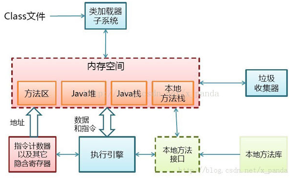
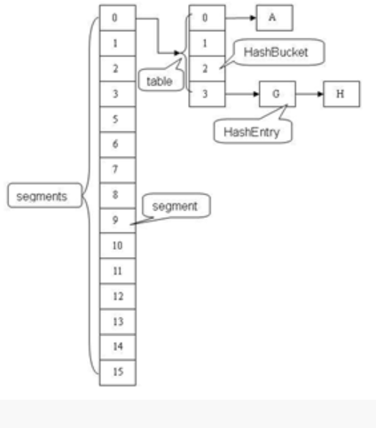

## 1、 JVM工作原理和流程  ##
 - Java是一种技术，它由四方面组成：Java编程语言、Java类文件格式、Java虚拟机和Java应用程序接口(Java API)

 - 运行期环境代表着Java平台，开发人员编写Java代码(.java文件)，然后将之编译成字节码(.class文件)，再然后字节码被装入内存，一旦字节码进入虚拟机，它就会被解释器解释执行，或者是被即时代码发生器有选择的转换成机器码执行。

 -  

 - [http://blog.csdn.net/CSDN_980979768/article/details/47281037?locationNum=7&fps=1](http://blog.csdn.net/CSDN_980979768/article/details/47281037?locationNum=7&fps=1)

## 2、 Java虚拟机的体系结构  ##

### 1、 每个JVM都有两种机制:
 
   - 类装载子系统：装载具有适合名称的类或接口
   - 执行引擎：负责执行包含在已装载的类或接口中的指令 

###  2、 每个JVM都包含: ###
 
 - 方法区、Java堆、Java栈、本地方法栈、指令计数器及其他隐含寄存器
 - 

## 3、Java代码编译和执行的整个过程 ##
 1. Java代码编译是由Java源码编译器来完成，也就是Java代码到JVM字节码（.class文件）的过程
 2. Java字节码的执行是由JVM执行引擎来完成
 
###  Java代码编译和执行的整个过程包含了以下三个重要的机制:  ###

 - Java源码编译机制
 - 类加载机制
 - 类执行机制
 
## 4、JVM内存管理及垃圾回收机制 ##

### 堆内存（heap） ###
 - 所有通过new创建的对象的内存都在堆中分配
 - 堆内存是向高地址扩展的数据结构，是不连续的内存区域
 - 堆获得的空间比较灵活，也比较大
 - 等待GC回收
### 栈内存（stack） ###
 - 基础数据类型直接在栈空间分配
 - 栈是向低地址扩展的数据结构，是一块连续的内存区域
 - 栈顶的地址和栈的最大容量是系统预先规定好的，因此，能从栈获得的空间较小
 - 生命周期结束后，系统直接回收
 
说明：
   引用数据类型，需要用new来创建，既在栈空间分配一个地址空间，又在堆空间分配对象的类变量 。方法的引用参数，在栈空间分配一个地址空间，并指向堆空间的对象区，当方法调用完成后从栈空间回收。字符串常量、static在DATA区域分配，this在堆空间分配。数组既在栈空间分配数组名称，又在堆空间分配数组实际的大小。

- 
### 本地方法栈（java中的jni调用） ###
### 方法区（method） ###
 - 它保存方法代码(编译后的java代码)和符号表。存放了要加载的类信息、静态变量、final类型的常量、属性和方法信息。

## 5、Java虚拟机的运行过程示例 ##
 - 
 - 

## 6、Java内存模型 ##
- [http://www.cnblogs.com/nexiyi/p/java_memory_model_and_thread.html](http://www.cnblogs.com/nexiyi/p/java_memory_model_and_thread.html)
- 堆、栈、perm区针对类、方法、常量、变量、基本类型等信息，各自定义明确的分工和划分

- 内存模型多个线程并发执行的情况进行了分工和划分

## 6、ThreadLocal使用原理 ##
	public class Thread implements Runnable {
		ThreadLocal.ThreadLocalMap threadLocals = null;
		
	}

	public class ThreadLocal<T> {
		public T get() { 
			map.set(this, value);
		}
		public void set(T value) {
			ThreadLocalMap map = getMap(t);
		}
		public void remove() { }
		protected T initialValue() { }//一般是用来在使用时进行重写的，

		ThreadLocalMap getMap(Thread t) {
        return t.threadLocals;}	

		static class ThreadLocalMap {
	        static class Entry extends WeakReference<ThreadLocal> {
	            Object value;
	            Entry(ThreadLocal k, Object v) {
	                super(k);
	                value = v;
	            }
	        }
	}

 - **ThreadLocal的作用是提供线程内的局部变量，这种变量在线程的生命周期内起作用，减少同一个线程内多个函数或者组件之间一些公共变量的传递的复杂度。**
 - ThreadLocal的设计思路：每个Thread维护一个ThreadLocalMap映射表，这个映射表的key是ThreadLocal实例本身，value是真正需要存储的Object。（threadLocals的类型ThreadLocalMap的键值为ThreadLocal对象，因为每个线程中可有多个threadLocal变量）
 - 实际的通过ThreadLocal创建的副本是存储在每个线程自己的threadLocals中的
 - 这样处理确实也没有任何问题，由于每次都是在方法内部创建的连接，那么线程之间自然不存在线程安全问题。但是这样会有一个致命的影响：导致服务器压力非常大，并且严重影响程序执行性能。由于在方法中需要频繁地开启和关闭数据库连接，这样不尽严重影响程序执行效率，还可能导致服务器压力巨大。
　　那么这种情况下使用ThreadLocal是再适合不过的了，因为ThreadLocal在每个线程中对该变量会创建一个副本，即每个线程内部都会有一个该变量，且在线程内部任何地方都可以使用，线程之间互不影响，这样一来就不存在线程安全问题，也不会严重影响程序执行性能。？？？？？
 - [http://transcoder.tradaquan.com/from=1000953f/bd_page_type=1/ssid=0/uid=0/pu=usm%401%2Csz%40320_1002%2Cta%40iphone_2_5.0_2_7.4/baiduid=3D496748F0550FF4E185BFD54405661B/w=0_10_/t=iphone/l=3/tc?ref=www_iphone&lid=16844027312331578431&order=2&fm=alhm&h5ad=1&srd=1&dict=32&tj=h5_mobile_2_0_10_title&w_qd=IlPT2AEptyoA_yilJFGcGiU9wAXWLiVAqZJlkq&sec=22465&di=f2ad7f44f73d962f&bdenc=1&tch=124.848.252.401.1.807&nsrc=IlPT2AEptyoA_yixCFOxXnANedT62v3IEQGG_ytK1DK6mlrte4viZQRAZjzzQH3PHZWgdj00sqdFtXLR0G5o7RZ0qbIwdzZz&eqid=e9c20198da806000100000065968241b&wd=&clk_info=%7B%22srcid%22%3A%221599%22%2C%22tplname%22%3A%22h5_mobile%22%2C%22t%22%3A1499997221064%2C%22sig%22%3A%2210005%22%2C%22xpath%22%3A%22div-a-h3%22%7D](http://transcoder.tradaquan.com/from=1000953f/bd_page_type=1/ssid=0/uid=0/pu=usm%401%2Csz%40320_1002%2Cta%40iphone_2_5.0_2_7.4/baiduid=3D496748F0550FF4E185BFD54405661B/w=0_10_/t=iphone/l=3/tc?ref=www_iphone&lid=16844027312331578431&order=2&fm=alhm&h5ad=1&srd=1&dict=32&tj=h5_mobile_2_0_10_title&w_qd=IlPT2AEptyoA_yilJFGcGiU9wAXWLiVAqZJlkq&sec=22465&di=f2ad7f44f73d962f&bdenc=1&tch=124.848.252.401.1.807&nsrc=IlPT2AEptyoA_yixCFOxXnANedT62v3IEQGG_ytK1DK6mlrte4viZQRAZjzzQH3PHZWgdj00sqdFtXLR0G5o7RZ0qbIwdzZz&eqid=e9c20198da806000100000065968241b&wd=&clk_info=%7B%22srcid%22%3A%221599%22%2C%22tplname%22%3A%22h5_mobile%22%2C%22t%22%3A1499997221064%2C%22sig%22%3A%2210005%22%2C%22xpath%22%3A%22div-a-h3%22%7D)
 - [http://blog.csdn.net/lufeng20/article/details/24314381](http://blog.csdn.net/lufeng20/article/details/24314381)
 - [http://blog.csdn.net/fan2012huan/article/details/51781443](http://blog.csdn.net/fan2012huan/article/details/51781443)
 - [http://blog.csdn.net/mlin_123/article/details/50807375](http://blog.csdn.net/mlin_123/article/details/50807375)
 - ThreadLocal是如何为每个线程创建变量的副本的：
　　首先，在每个线程Thread内部有一个ThreadLocal.ThreadLocalMap类型的成员变量threadLocals，这个threadLocals就是用来存储实际的变量副本的，键值为当前ThreadLocal变量，value为变量副本（即T类型的变量）。
　　初始时，在Thread里面，threadLocals为空，当通过ThreadLocal变量调用get()方法或者set()方法，就会对Thread类中的threadLocals进行初始化，并且以当前ThreadLocal变量为键值，以ThreadLocal要保存的副本变量为value，存到threadLocals。
　　然后在当前线程里面，如果要使用副本变量，就可以通过get方法在threadLocals里面查找。[http://transcoder.tradaquan.com/from=1000953f/bd_page_type=1/ssid=0/uid=0/pu=usm%401%2Csz%40320_1002%2Cta%40iphone_2_5.0_2_7.4/baiduid=3D496748F0550FF4E185BFD54405661B/w=0_10_/t=iphone/l=3/tc?ref=www_iphone&lid=16844027312331578431&order=2&fm=alhm&h5ad=1&srd=1&dict=32&tj=h5_mobile_2_0_10_title&w_qd=IlPT2AEptyoA_yilJFGcGiU9wAXWLiVAqZJlkq&sec=22465&di=f2ad7f44f73d962f&bdenc=1&tch=124.848.252.401.1.807&nsrc=IlPT2AEptyoA_yixCFOxXnANedT62v3IEQGG_ytK1DK6mlrte4viZQRAZjzzQH3PHZWgdj00sqdFtXLR0G5o7RZ0qbIwdzZz&eqid=e9c20198da806000100000065968241b&wd=&clk_info=%7B%22srcid%22%3A%221599%22%2C%22tplname%22%3A%22h5_mobile%22%2C%22t%22%3A1499997221064%2C%22sig%22%3A%2210005%22%2C%22xpath%22%3A%22div-a-h3%22%7D](http://transcoder.tradaquan.com/from=1000953f/bd_page_type=1/ssid=0/uid=0/pu=usm%401%2Csz%40320_1002%2Cta%40iphone_2_5.0_2_7.4/baiduid=3D496748F0550FF4E185BFD54405661B/w=0_10_/t=iphone/l=3/tc?ref=www_iphone&lid=16844027312331578431&order=2&fm=alhm&h5ad=1&srd=1&dict=32&tj=h5_mobile_2_0_10_title&w_qd=IlPT2AEptyoA_yilJFGcGiU9wAXWLiVAqZJlkq&sec=22465&di=f2ad7f44f73d962f&bdenc=1&tch=124.848.252.401.1.807&nsrc=IlPT2AEptyoA_yixCFOxXnANedT62v3IEQGG_ytK1DK6mlrte4viZQRAZjzzQH3PHZWgdj00sqdFtXLR0G5o7RZ0qbIwdzZz&eqid=e9c20198da806000100000065968241b&wd=&clk_info=%7B%22srcid%22%3A%221599%22%2C%22tplname%22%3A%22h5_mobile%22%2C%22t%22%3A1499997221064%2C%22sig%22%3A%2210005%22%2C%22xpath%22%3A%22div-a-h3%22%7D)

## 7、ConcurrentHashMap 原理分析##
 - 
 - 对于一个key，需要经过三次hash操作，才能最终定位这个元素的位置，这三次hash分别为：
 	- 1、对于一个key，先进行一次hash操作，得到hash值h1，也即h1 = hash1(key)；
	- 2、将得到的h1的高几位进行第二次hash，得到hash值h2，也即h2 = hash2(h1高几位)，通过h2能够确定该元素的放在哪个Segment；//比HashMap多出这一步，确定segment
	- 3、将得到的h1进行第三次hash，得到hash值h3，也即h3 = hash3(h1)，通过h3能够确定该元素放置在哪个HashBucket。
 - put 方法加锁；
 - get方法不加锁，通过volatile和final来确保数据安全（如果value为null，会调用readValueUnderLock，只有这个步骤会加锁）；
 - remove方法，JDK1.7中，HashEntry中的next指针定义为volatile，而且每次删除一个节点时，会将删除节点之前的所有节点 **拷贝一份组成一个新的链**，而将当前节点的上一个节点的next指向当前节点的下一个节点，从而在删除以后 **有两条链存在**；
 - 
 - size()方法，**先给3次机会**，如果三次机会中，modCount参数没变，则返回size的值；否则，锁定所有的segment；
 - ContainsValue()方法，和size()方法的思想一样
 - ConcurrentHashMap中的key和value值都不能为null，HashMap中key可以为null，HashTable中key不能为null。
 - ConcurrentHashMap是线程安全的类并不能保证使用了ConcurrentHashMap的操作都是线程安全的！
 - JDK6版一开始就把segment都创建了，所以next字段就是final的（不可变）；JDK7版lazy创建除第一个之外的其它segment，所以next字段要在lazy创建之后赋值，所以改为volatile。
 - HashEntry为entry链的一个节点。在jdk1.6中，hashentry的key、next都为final类型，在jdk1.7中，hashentry的key为final，next为violate，由于jdk1.6中next字段设置成了final的，直接后果就是不能直接通过修改指针删除结点，需要把待删除结点之前的结点全部复制一遍，然后将prev.next在初始化时重置为待删除结点之后的结点。[https://www.zhihu.com/question/27469719](https://www.zhihu.com/question/27469719)

 - [https://my.oschina.net/hosee/blog/639352](https://my.oschina.net/hosee/blog/639352)

## 多线程 ##
 - [http://www.admin10000.com/document/10467.html](http://www.admin10000.com/document/10467.html)

## 8、Synchronized原理 ##
 - synchronized的锁机制会根据线程竞争情况在运行会有偏向锁、轻量锁、对象锁，自旋锁（或自适应自旋锁）等
 - 因为线程阻塞后进入排队队列和唤醒都需要CPU从用户态转为核心态，尤其频繁的阻塞和唤醒对CPU来说是负荷很重的工作——>自旋锁
 - 轻量锁或偏向锁使用的条件是进入synchronized区域时没有其他任何其他线程在使用，旦出现了多线程竞争时，synchronized区域的轻量锁或偏向锁都会立即升级为重量锁。
 - [用法](http://blog.csdn.net/luoweifu/article/details/46613015 )
 
### 同步的原理 ###
- JVM基于进入和退出Monitor对象来实现方法同步和代码块同步，但两者的实现细节不一样。代码块同步是使用monitorenter和monitorexit指令实现。monitorenter指令是在编译后插入到同步代码块的开始位置，而monitorexit是插入到方法结束处和异常处。任何对象都有一个monitor与之关联，当且一个monitor被持有后，它将处于锁定状态。线程执行到 monitorenter 指令时，将会尝试获取对象所对应的 monitor 的所有权，即尝试获得对象的锁。

### 自旋锁 ###
 - monitor并不把线程阻塞放入排队队列，而是去执行一个无意义的循环，循环结束后看看是否锁已释放并直接进行竞争上岗步骤，如果竞争不到继续自旋循环，循环过程中线程的状态一直处于running状态。
 - 
### 轻量锁 ###
 - 加锁过程： 在当前线程的栈帧（stack frame）中生成一个锁记录（lock record），这个锁记录比前面说的那个对象锁（管理线程队列的monitor）简单多了，它只是对象头的一个拷贝。然后把对象头里的tag改成00，并把这个栈帧里的lock record地址放入对象头里。若操作成功，那就完成了轻量锁操作。如果不成功，说明有线程在竞争，则需要在当前对象上生成重量锁来进行多线程同步，然后将Tag状态改为10，并生成Monitor对象（重量锁对象），对象头里也会放入Monitor对象的地址。最后将当前线程t排队队列中。
 - 解锁过程：把栈帧里刚才的那个lock record拷贝到对象头里，若替换成功，则解锁完成，若替换不成功，表示在当前线程持有锁的这段时间内，其他线程也竞争过锁，并且发生了锁升级为重量锁，这时需要去Monitor的等待队列中唤醒一个线程去重新竞争锁。
 -
### 偏向锁 ###
- 偏向锁是比轻量锁还轻量的锁机制。当synchronized区域长期都由同一个线程加锁、解锁时，jvm就用偏向锁来做，它的加锁解锁比轻量锁操作起来指令更加简化

### 膨胀过程描述 ###
偏向锁、轻量级锁、重量级锁三者各自的应用场景：

- 偏向锁：只有一个线程进入临界区；
- 轻量级锁：多个线程交替进入临界区；
- 重量级锁：多个线程同时进入临界区。

		synchronized (lockObject) {
	    	// do something
		}

上述同步代码块中存在一个临界区，假设当前存在Thread#1和Thread#2这两个用户线程，分三种情况来讨论：

- 情况一：只有Thread#1会进入临界区；
- 情况二：Thread#1和Thread#2交替进入临界区；
- 情况三：Thread#1和Thread#2同时进入临界区。
	- 上述的情况一是偏向锁的适用场景，此时当Thread#1进入临界区时，JVM会将lockObject的对象头Mark Word的锁标志位设为“01”，同时会用CAS操作把Thread#1的线程ID记录到Mark Word中，此时进入偏向模式。所谓“偏向”，指的是这个锁会偏向于Thread#1，若接下来没有其他线程进入临界区，则Thread#1再出入临界区无需再执行任何同步操作。也就是说，若只有Thread#1会进入临界区，实际上只有Thread#1初次进入临界区时需要执行CAS操作，以后再出入临界区都不会有同步操作带来的开销。
	- 然而情况一是一个比较理想的情况，更多时候Thread#2也会尝试进入临界区。若Thread#2尝试进入时Thread#1已退出临界区，即此时lockObject处于未锁定状态，这时说明偏向锁上发生了竞争（对应情况二），此时会撤销偏向，Mark Word中不再存放偏向线程ID，而是存放hashCode和GC分代年龄，同时锁标识位变为“01”（表示未锁定），这时Thread#2会获取lockObject的轻量级锁。因为此时Thread#1和Thread#2交替进入临界区，所以偏向锁无法满足需求，需要膨胀到轻量级锁。如果 Thread#2尝试 进入时， Thread#1还没从临界区退出，膨胀到重量级锁，偏向锁和轻量级锁虽然叫锁，其实处理不了并发冲突。
	- 再说轻量级锁什么时候会膨胀到重量级锁。若一直是Thread#1和Thread#2交替进入临界区，那么没有问题，轻量锁hold住。一旦在轻量级锁上发生竞争，即出现“Thread#1和Thread#2同时进入临界区”的情况，轻量级锁就hold不住了。 （根本原因是轻量级锁没有足够的空间存储额外状态，此时若不膨胀为重量级锁，则所有等待轻量锁的线程只能自旋，可能会损失很多CPU时间）
	- [https://www.zhihu.com/question/53826114](https://www.zhihu.com/question/53826114)

- [http://blog.csdn.net/vincent1007/article/details/53999073](http://blog.csdn.net/vincent1007/article/details/53999073)
 
- [http://www.jianshu.com/p/ebaa1a03c594](http://www.jianshu.com/p/ebaa1a03c594)

## 9、Volatile的原理 ##
- 当对象和变量存储到计算机的各个内存区域时，必然会面临一些问题，其中最主要的两个问题是：1. 共享对象对各个线程的可见性   2. 共享对象的竞争现象
- 要解决共享对象可见性这个问题，我们可以使用java volatile关键字。 volatile 关键字可以保证变量会直接从主存读取，而对变量的更新也会直接写到主存
- 要解决共享对象的竞争我们可以使用java synchronized代码块。synchronized代码块可以保证同一个时刻只能有一个线程进入代码竞争区，synchronized代码块也能保证代码块中所有变量都将会从主存中读（通过创建一个内存屏障），当线程退出代码块时，对所有变量的更新将会flush到主存，不管这些变量是不是volatile类型的。
- JMM确保在不同的编译器和不同的处理器平台之上，通过插入特定类型的**Memory Barrier**来禁止特定类型的**编译器重排序和处理器重排序**，为上层提供一致的内存可见性保证。
- volatile原理是基于CPU内存屏障指令实现的,如果一个变量是volatile修饰的，JMM会在写入这个字段之后插进一个Write-Barrier指令，并在读这个字段之前插入一个Read-Barrier指令
- [http://blog.csdn.net/suifeng3051/article/details/52611310#t5](http://blog.csdn.net/suifeng3051/article/details/52611310#t5)

## 10、Volatile和synchronize的区别 ##
线程安全的两个方面：执行控制和内存可见

- volatile本质是在告诉jvm当前变量在寄存器（工作内存）中的值是不确定的，需要从主存中读取； synchronized则是锁定当前变量，只有当前线程可以访问该变量，其他线程被阻塞住
- volatile仅能使用在变量级别；synchronized则可以使用在变量、方法、和类级别的
- volatile仅能实现变量的修改可见性，不能保证原子性；而synchronized则可以保证变量的修改可见性和原子性
- volatile不会造成线程的阻塞；synchronized可能会造成线程的阻塞。
- volatile标记的变量不会被编译器优化；synchronized标记的变量可以被编译器优化
- [http://blog.csdn.net/suifeng3051/article/details/52611233](http://blog.csdn.net/suifeng3051/article/details/52611233)
## 9、CPU、高速缓冲、内存、硬盘 ##
 CPU(一级二级三级缓冲)——>内存——>硬盘(缓冲区)

## 10、内存溢出、泄露、越界、缓冲区溢出、栈溢出 ##
### 内存分为四段：栈区，堆区，代码区，全局变量区###
- 内存溢出(Out Of Memory)是指：是指程序在申请内存时，没有足够的内存空间供其使用
- 内存越界：向系统申请了一块内存，而在使用内存时，超出了申请的范围（常见的有使用特定大小数组时发生内存越界）
- 注意：内存越界跟内存溢出的区别，前者是在使用系统提供的内存时，做了一些超出申请的内存范围的操作；而后者则是在申请内存大小时就已超出系统能提供的。
- 内存泄露（memory leak）：向系统申请分配内存时使用(new)，但是使用完后不归还（delete），使得申请到的那块内存你自己也不能再访问了（也许你把它的地址给弄丢了），而系统也不能再次将它分配给需要的程序。
- 注意：memory leak 发生多了最终会导致out of memory。
- 缓冲区溢出：当计算机向缓冲区内填充数据位数时，超过了缓冲区本身的容量，溢出的数据覆盖在合法数据上。
- 缓冲区溢出和内存溢出的区别，前者是溢出后的数据会覆盖到计算机内存中以前的内容。除非这些被覆盖的内容被保存或能够恢复，否则就会永远丢失。
- 栈溢出：栈溢出就是缓冲区溢出的一种

