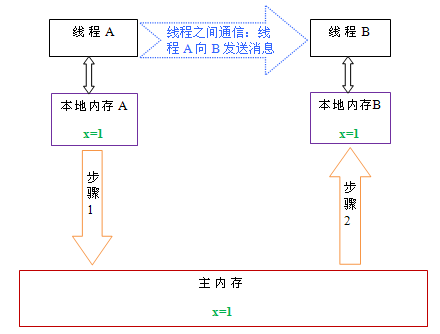

# Java内存模型 #
## 概念 ##
- JMM，Java Memory Model，定义JVM在计算机内存(RAM)中的工作方式。
- JVM是整个计算机的虚拟模型，所以JMM隶属于JVM。

## 抽象模型 ##
### 模型 ###
- 线程之间的共享变量储存在主内存中。
- 每个线程都有一个私有的本地内存，储存了该线程读写共享变量的副本。
- 本地内存是一个抽象概念，涵盖缓存、写缓冲区、寄存器、其他硬件和编译器优化

### 通信的实现 ###
1. 首先，线程A把本地内存A中更新过的共享变量刷新到主内存中去。
2. 然后，线程B到主内存中去读取线程A之前已更新过的共享变量。 

## JVM对java内存模型的实现 ##

### 简化版 ###
- 共享的堆区。
- 每个线程私有的线程栈区。
#### 线程栈区 ####
- 包含当前线程执行的方法的调用信息。
- 包含当前方法的所有本地变量（原始类型、对象的引用），对其他线程不可见。
#### 堆 ####
- 包含所有线程创建的对象。
- 类本身。

### 细节版 ###
- 程序计数器：指向当前所执行的字节码。
- java虚拟机栈：执行java方法服务，储存局部变量、操作数栈、动态链接、方法出口等。
- 本地方法栈：类似java虚拟机栈，但执行Native方法。
- java堆：存放对象实例。
- 方法区：存储已被虚拟机加载的类信息、常量、静态变量、即时编译器变异后的代码等。

## 硬件内存模型 ##
- CPU寄存器、CPU缓存、主存。

## JMM和硬件的关系 ##
- 交叉关系。

## 参考 ##
- [http://blog.csdn.net/suifeng3051/article/details/52611310#t5](http://blog.csdn.net/suifeng3051/article/details/52611310#t5)
- [http://www.jb51.net/article/84235.htm](http://www.jb51.net/article/84235.htm)