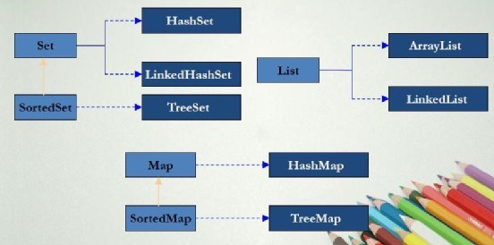

## 参考链接 ##
- [Java方向如何准备BAT技术面试答案(汇总版)](https://zhuanlan.zhihu.com/p/26679704)

## 1、面向对象和面向过程的区别 ##
- 面向过程优点：性能高，因为类调用的时候需要实例化，开销比较大；
- 面向对象优点：易维护、易复用、易扩展，因为面向对象有封装、继承、多态的特性，可以设计出低耦合的系统，使系统更加灵活、更加易于维护。

## 2、java的四个基本特性 ##
### 1、抽象 ###
- 把现实中的某一类东西用代码表示，通常叫做类或者接口。
- 抽象包括两个方面：数据抽象--对象的域，过程抽象--对象的方法。
### 2、封装： ###
- 把客观事物抽象成类，类的域和方法只让可信的类或者对象操作，对不可信的隐藏。
- 封装分为域的封装和方法的封装。
### 3、 继承： ###
- 把拥有共同特性的多个类抽象成一个类，这个类是他们的父类，这些类继承这个父类。
- 父类的意义在于抽取多类事物的共性。
### 4、 多态： ###
- 允许不同类的对象对同一消息（方法调用）做出响应。即同一消息可以根据发送对象的不同而采取不同的行为方式。
- 实现技术：动态绑定--根据实例的运行期类型调用相应的方法。
- 作用：消除类型之间的耦合。
- 必要条件：继承、重写、父类引用指向子类的对象。

### 5、调用顺序 ###
- 优先级由高到低依次为：this.show(O)、super.show(O)、this.show((super)O)、super.show((super)O)。
- [http://blog.csdn.net/free4294/article/details/39054791](http://blog.csdn.net/free4294/article/details/39054791) 

## 3、重载和重写的区别 ##
- 重载：在同一个类中，方法名相同，参数列表不同，返回值和访问修饰符可以不同也可以相同，发生在编译时。
- 重写：在父子类中，方法名和参数列表相同，子类返回值类型<=父类返回值类型（不包括基本类型），子类抛出异常<=父类抛出异常，子类访问修饰符>=父类访问修饰符（如果父类方法的访问修饰符为private，则子类中就不是重写）。

## 4、Constructor ##
- Constructor不能被override，不能用static修饰。

## 5、访问控制符的区别 ##
- private:本类。
- public:任何类。
- protected:同包的类、子类。
- 默认:同包的类。

## 6、String类不可继承 ##
String是final类，final修饰过的都不能继承。

## 7、String,StringBuffer,StringBuilder的区别 ##
### 1、可变性 ###
- String中使用final char value[]，不可变。
- StringBuffer,StringBuilder继承AbstractStringBuilder使用char[] value，可变。
### 2、线程安全性 ###
- String不可变，线程安全。
- StringBuffer对方法使用同步锁，线程安全。
- StringBuilder没有对方法加同步锁，非线程安全。
### 3、性能 ###
- String每次改变时都会生成一个新的String对象。
- StringBuffer,StringBuilder只是对象本身操作，StringBuilder性能比StringBuilder高10%。

## 8、hashCode和equals的关系 ##
- equals相等-->hashcode相等。
- 重写equals时一定要重写hashcode，否则在使用hashtable等需要使用hashcode的时候很有可能会出问题（contain函数在hashcode相同的bucket中查找是否存在equals的对象）。
- 使用HashMap，如果key是自定义的类，就必须重写hashcode()和equals()。 
 - [http://blog.csdn.net/tuolaji8/article/details/48417031](http://blog.csdn.net/tuolaji8/article/details/48417031)
### 重写 ###
	//user类
    public class User{    
	    private String name;
	    private int age;
	    private String passport;
	
		//getters and setters, constructor
	}

	User user1 = new User("mkyong", 35, "111222333");
    User user2 = new User("mkyong", 35, "111222333");
	//比较结果
    System.out.println(user1.equals(user2)); // false

	//经典方式
	public class User {
	    private String name;
	    private int age;
	    private String passport;
	    //getters and setters, constructor
	    @Override
	    public boolean equals(Object o) {
	        if (o == this) return true;
	        if (!(o instanceof User)) {
	            return false;
	        }
	        User user = (User) o;
	        return user.name.equals(name) &&
	                user.age == age &&
	                user.passport.equals(passport);
	    }
	    //Idea from effective Java : Item 9
	    @Override
	    public int hashCode() {
	        int result = 17;
	        result = 31 * result + name.hashCode();
	        result = 31 * result + age;
	        result = 31 * result + passport.hashCode();
	        return result;
	    }
	}
	
	//对于JDK7及更新版本，你可以是使用java.util.Objects 来重写 equals 和 hashCode 方法，代码如下
	import java.util.Objects;

	public class User {
	    private String name;
	    private int age;
	    private String passport;
	
	    //getters and setters, constructor
	
	    @Override
	    public boolean equals(Object o) {
	        if (o == this) return true;
	        if (!(o instanceof User)) {
	            return false;
	        }
	        User user = (User) o;
	        return age == user.age &&
	                Objects.equals(name, user.name) &&
	                Objects.equals(passport, user.passport);
	    }
	
	    @Override
	    public int hashCode() {
	        return Objects.hash(name, age, passport);
	    }
	
	}

## 9、抽象类和接口的区别 ##
### 1、语法 ###
- abstract class A {
	abstract void method();
}
- interface A {
	void method();
}
- interface某种意义上说是一种特殊的abstract class,是对行为的抽象；只能够有public static final的域（interface中一般不定义域）；所有方法都是public abstract的。
- abstract class中可以赋予方法默认行为；interface中方法不能有默认行为。
- 一个类只能继承一个abstract class，但可以实现多个interface。
### 2、设计理念 ###
- abstarct class体现继承关系，父类和子类在概念本质上相同。
- interface的实现者仅仅实现interface定义的契约。

## 10、自动装箱和拆箱 ##
- 装箱：将基本类型用对应的包装类包类型。
- 拆箱：将包装类型转换为基本数据类型。
- java编译器会在编译器根据语法决定是否装箱和拆箱。

## 11、什么是泛型，为什么使用，什么是类型擦除 ##
- 泛型：参数化类型，适用于多种类型。
- 使用：创建集合时就指定元素的类型，该集合只能保存制定类型的元素。
- 类型擦除:java编译器生成的字节码不包含泛型类型信息，类型信息在编译处理时被擦除，用最顶级的父类类型替换。

## 12、java中集合类的关系 ##
- List,Set,Queue接口继承自Collection接口。
- Set无序、元素不重复，主要实现类有HashSet（底层用hashmap实现，基于哈希表）和TreeSet（红黑树）
- List有序、元素可重复，主要实现类有ArrayList,LinkedList,Vector。
- Map和Collection接口无关，Map是key对value的映射集合,key不能重复，value可以重复，主要实现类有HashMap,TreeMap,HashTable。

## 13、HashMap实现原理 ##
- [HashMap的工作原理](http://www.admin10000.com/document/3322.html)
- [深入Java集合学习系列：HashMap的实现原理](http://zhangshixi.iteye.com/blog/672697)
- 

- HashMap 实际上是一个链表的数组
- 如果两个 Entry 的 key 的 hashCode() 返回值相同，那它们的存储位置相同。如果这两个 Entry 的 key 通过 equals 比较返回 true，新添加 Entry 的 value 将覆盖集合中原有 Entry 的 value，但 key 不会覆盖;如果这两个 Entry 的 key 通过 equals 比较返回 false，新添加的 Entry 将与集合中原有 Entry 形成 Entry 链，而且新添加的 Entry 位于 Entry 链的头部
 出自：[http://blog.csdn.net/caihaijiang/article/details/6280251](http://blog.csdn.net/caihaijiang/article/details/6280251)
- get方法，两个key的hashcode,equals都要相等。hashcode确定在哪个桶，equals确定桶中的位置
- 当一个map填满了75%(load factor)的bucket时候，将会创建原来HashMap大小的两倍的bucket数组(Entry[] newTable=new Entry[newCapacity])，在调整大小的过程中，存储在LinkedList中的元素的次序会反过来（为了加快扩容时的速度，如果要正序，那么需要每次都遍历到一个entry链表的最后一个entry）。在多线程情况下，重新调整大小可以会产生条件竞争
- 负载因子指的是table数组的负载比例，与entry链无关，初始的table数组的大小是16，负载因子是0.75.也就是说，当table数组中有16*0.75个位置被占用后，就需要扩容。
- JDK1.8中的HashMap,[http://blog.csdn.net/qq_34483204/article/details/72546571](http://blog.csdn.net/qq_34483204/article/details/72546571)

### HashMap 的高性能需要保证以下几点： ###

1.Hash 算法必须是高效的；
2.Hash 值到内存地址 (数组索引) 的算法是快速的；
3.根据内存地址 (数组索引) 可以直接取得对应的值。

### HashMap 的一个功能缺点是它的无序性： ###

- LinkedHashMap（继承自 HashMap）、TreeMap有序
- LinkedHashMap 是根据元素增加或者访问的先后顺序进行排序（同时在 - HashMap 的基础上，又在内部增加了一个链表，用以存放元素的顺序。），而 TreeMap 则根据元素的 Key 进行排序。

### 为什么String, Interger这样的wrapper类适合作为键？ ###

因为String是不可变的，也是final的，而且已经重写了equals()和hashCode()方法了

## 14、HashTable实现原理 ##
- [Java 集合系列11之 Hashtable详细介绍(源码解析)和使用示例](http://www.cnblogs.com/skywang12345/p/3310887.html)
- [Hashtable源码剖析](http://blog.csdn.net/chdjj/article/details/38581035)

## 15、HashMap和HashTable的区别 ##
- HashTable线程安全，HashMap非线程安全。
- HashTable不允许有null(key和value)，HashMap允许null(key和value)。
- HashTable多出一个contains方法，与containsValue功能一样，而不是containsKey。
- HashTable用Enumeration遍历；HashMap用Iterator遍历。
- HashTable中数组默认大小11，增加方式old*2+1；HashMap中数组默认大小16，增加方式<<1。
- HashTable直接使用对象的hashCode；HashMap重新计算hash值，并且用与代替求模。
### 注： ###
- Enumeration:只能读取不能修改，不支持fail-fast机制。
- Iterator：能读取能删除，支持fail-fast机制。
- fail-fast机制：当线程A通过iterator遍历集合时，若集合的内容被其他线程改变，那么线程A就会抛出异常，即产生fail-fast事件。
http://blog.csdn.net/caihaijiang/article/details/6280251
http://alex09.iteye.com/blog/539549

## 16、ArrayList和Vector区别 ##
- Vector线程安全，ArrayList非线程安全。
- 初始容量都是10，自动扩容时，Vector增长1倍，ArrayList增长1/2。

## 17、ArrayList和LinkedList的区别和使用场景 ##
### 区别 ###
- ArrayList底层数组实现，可以随机查找。
- LinkedList底层双向链表实现，增删速度快。实现Queue接口。
### 场景 ###
- LinkedList适合从中间插入或删除。
- ArrayList适合检索和在末尾插入或删除。

## 18、Collection和Collections的区别 ##
- Collection是一个接口，提供对集合对象基本操作的通用接口方法。
- Collections是一个类，包含集合操作的静态方法。该类不能实例化(因为它的构造函数被private修饰)。
- Collections.sort(List<T> list);

## 19、ConcurrenthashMap实现原理 ##
- Hashtable的synchronized是针对整张表，Concurrenthashmap使用多个锁控制对表不同部分的修改。
- [Java集合---ConcurrentHashMap原理分析](http://www.cnblogs.com/ITtangtang/p/3948786.html)
- [ConcurrentHashMap](http://ifeve.com/concurrenthashmap/)

## 20、Error、Exception区别 ##
- Error和Exception都继承tThrowable。
- Error类一般指与虚拟机相关的问题，比如系统崩溃，虚拟机错误，内存空间不足，方法调用栈溢出。这类错误导致的应用程序中断仅靠程序本身无法恢复和预防，应该终止程序。
- Exception类表示程序可以处理的异常，可以捕获并且可能恢复。这类异常应该尽可能处理。

## 21、checked和unchecked ##
### unchecked Exception ###
- 通常是自身的问题。
- 程序瑕疵或者逻辑错误，运行时无法恢复。
- 包括Error和RuntimeException及其子类。（比如：NullPointerException,没有人特意去处理）
- 语法上不需要抛出异常。
### checked Exception ###
- 程序不能直接控制的无效外界情况（用户输入，数据库问题，网络异常，文件丢失）。
- 除了Error和RuntimeException及其子类之外的类。
- 需要try catch处理或者throws抛出异常。

## 22、java如何实现代理机制 ##
- 代理模式：为其他对象提供一种代理，以控制对这个对象的访问。
- jdk动态代理：代理类和委托类实现了共同的接口，用到InvocationHandler接口。
- cglib动态代理：代理类是目标类的子类，用到MethodInterceptor接口。

## 23、多线程的实现方式 ##
- Thread + Runnable。（thread.start()）
- ExecutorService + Runable，不返回值。
- ExecutorService + Callable，返回Future。
 
	    public class ThreadEx {
	    	public static void main(String[] args) throws InterruptedException, ExecutionException {
	    		Thread thread = new Thread(new Runnable() {
	    
	    			@Override
	    			public void run() {
	    				// TODO Auto-generated method stub
	    
	    			}
	    		});
	    		thread.start();
	    
	    		ExecutorService executorService = Executors.newCachedThreadPool();
	    		executorService.execute(new Runnable() {
	    
	    			@Override
	    			public void run() {
	    				// TODO Auto-generated method stub
	    
	    			}
	    		});
	    		//submit方法有返回值，即call()方法的返回值
	    		Future<Integer> future = executorService.submit(new Callable<Integer>() {
	    
	    			@Override
	    			public Integer call() throws Exception {
	    				// TODO Auto-generated method stub
	    				return 1;
	    			}
	    		});
	    		System.out.println(future.get());
	    		executorService.shutdown();
	    	}
	    }

- runnable和callable的区别
	1. Callable规定的方法是call()，而Runnable规定的方法是run(). 
	2. Callable的任务执行后可返回值，而Runnable的任务是不能返回值的
	3. call()方法可抛出异常，而run()方法是不能抛出异常的。 
	4. 运行Callable任务可拿到一个Future对象，Future表示异步计算的结果。它提供了检查计算是否完成的方法,以等

## 24、线程的状态转换 ##
resume,suspend，stop已经废止，因为可能导致死锁。

 - 新建状态：新建线程对象，并没有调用start()方法之前

 - 就绪状态：调用start()方法之后线程就进入就绪状态，但是并不是说只要调用start()方法线程就马上变为当前线程，在变为当前线程之前都是为就绪状态。值得一提的是，线程在睡眠和挂起中恢复的时候也会进入就绪状态哦。

 - 运行状态：线程被设置为当前线程，开始执行run()方法。就是线程进入运行状态

 - 阻塞状态：线程被暂停，比如说调用sleep()方法后线程就进入阻塞状态

 - 死亡状态：线程执行结束

## 25、如何终止一个线程 ##
1. 线程里面是一个循环。设置一个标志位，在循环检查的时候跳出循环。
2. 线程因为sleep,wait,join(thread1.join()主线程会等待thread1运行结束后，才会继续向下运行)等阻塞或者挂起的时候。使用interrupt，产生InterruptedException异常，从而跳出线程。

## 26、什么是线程安全 ##
- 多个线程可能会同时运行一段代码，每次运行的结果和单线程运行的结果是一样的，而且其他变量的值也和预期的是一样的。
- 《Java Concurrency In Practice》：当多个线程访问同一个对象时，如果不用考虑这些线程在运行时环境下的调度和交替执行，也不需要进行额外的同步，或者调用方法进行任何其他的协调操作，调用这个对象的行为都可以获得正确的结果，那这个对象就是线程安全的。

## 27、如何保证线程安全 ##
- 对非安全的代码进行加锁，synchronized,volatile,lock等。
- 使用线程安全的类。
- 多线程并发情况下，线程共享的变量改为方法级的局部变量。

## 28、synchronized如何使用 ##
### 使用synchronized同步方法 ###
- 静态方法，需要获得类锁。
- 非静态方法，需要获得对象锁。
### 使用synchronized同步代码段 ###
- synchronized(类.class){}，需要获得类锁。
- synchronized(this,其他对象)，需要获得对象锁。

## 29、synchronized和Lock的区别 ##
- Lock能完成synchronized所实现的所有功能。
- Lock的锁定是通过代码实现的，synchronized是在JVM层次上实现的
- Lock需要手动在finally从句中释放锁，synchronized自动释放锁。
- Lock可以通过tryLock方法用非阻塞方式去拿锁。
- Lock锁的范围：代码块；synchronized锁的范围：代码块，对象，类。

## 30、多线程如何进行信息交互 ##
- wait(long timeout)：挂起线程，释放对象锁，直到时间到期或其他线程调用该对象的notify(),notifyAll()。
- wait()：挂起线程，释放对象锁，直到其他线程调用该对象的notify(),notifyAll()。
- notify()：唤醒该对象上wait的单个线程。
- notifyAll()：唤醒该对象上wait的所有线程。

## 31、sleep和wait的区别 ##
- sleep是Thread中的方法，wait是Object中的方法。
- sleep：线程不会释放对象锁；wait：线程释放对象锁。

## 32、多线程和死锁 ##
### 定义 ###
- 任务A等待任务B，任务B等待任务C，直到这个链条上的任务等待任务A释放锁，这样就出现了一个任务之间相互等待的连续循环，若无外力作用他们都将无法继续。
### 原因 ###
- 系统资源不足。
- 进程推进的顺序不合适。
- 资源分配不当。

## 33、产生死锁的必要条件 ##
1. 互斥条件：进程使用的资源中至少有一个不能共享。
2. 请求与保持条件：进程因为请求资源阻塞时，保持已获得的资源。
3. 不剥夺条件：进程已获得的资源在未使用完之前不能被强行剥夺。
4. 循环等待条件：A等待B的资源，B等待C的资源，直到某个进程等待A的资源，使得所有进程都无法继续。
5. 死锁例子[http://blog.csdn.net/qq_35064774/article/details/51793656](http://blog.csdn.net/qq_35064774/article/details/51793656)

## 34、死锁的预防 ##
#### 打破产生死锁的四个必要条件中的一个或几个 ####
1. 互斥条件：允许进程同时访问某些资源，但是有的资源不允许同时访问，比如打印机。该方法无实用价值。
2. 请求与保持条件：实行资源预分配策略，即进程在运行前一次性的向系统申请所需要的全部资源。如果某个资源得不到满足，则不分配资源，进程阻塞；只有满足进程的全部资源需求时，才一次性的将所申请的资源全部分配给该进程。
3. 不剥夺条件：允许进程强行从占有者那里夺取资源，即一个进程拥有某些资源，但是新申请的资源不能立刻满足，该进程必须释放所占有的全部资源。该方法实现困难，会降低性能。
4. 循环等待条件：实行资源有序分配策略，即把资源事先编号，所有进程请求资源先编号小的再编号大的，这样就不会产生环路。

## 35、守护进程是什么，如何实现 ##
- 程序运行时在后台提供一种通用服务的线程，当非后台线程结束时，程序也就终止，同时杀死进程中的所有后台线程。
- setDaemon(true)。

## 36、java线程池技术及原理 ##
### 目的 ###
- 如果并发的线程数量很多，并且每个线程执行一个时间很短的任务就结束，这样频繁创建线程会大大降低系统的效率。
- 使用线程池可以使得线程复用，即线程执行完一个任务不被销毁而是继续执行其他任务。
### 任务处理策略 ###
- 线程池中的当前线程数poolSize。
- poolSize<corePoolSize，则每来一个任务，就创建一个线程执行这个任务。
- poolSize>=corePoolSize，则每来一个任务，则添加到任务缓存队列。添加成功（一般队列未满），则该任务会等待空闲线程将其取出执行；添加失败（一般是缓存队列已满）且poolSize<maximumPoolSize，则创建新的线程执行这个任务。
- poolSize>=maximumPoolSize，则采取任务拒绝策略。
- poolSize>corePoolSize，如果某线程空闲时间超过keepAliveTime,线程将被终止，直到poolSize<=corePoolSize；如果允许设置核心池中的存活时间，核心池中的线程空闲时间超过keepAliveTime，该线程也会被终止。
- [Java并发编程：线程池的使用](http://www.cnblogs.com/dolphin0520/p/3932921.html)
### java的四种线程池 ###
1. newSingleThreadExecutor
创建一个单线程的线程池。这个线程池只有一个线程在工作，也就是相当于单线程串行执行所有任务。如果这个唯一的线程因为异常结束，那么会有一个新的线程来替代它。此线程池保证所有任务的执行顺序按照任务的提交顺序执行。
2. newFixedThreadPool
创建固定大小的线程池。每次提交一个任务就创建一个线程，直到线程达到线程池的最大大小。线程池的大小一旦达到最大值就会保持不变，如果某个线程因为执行异常而结束，那么线程池会补充一个新线程。
3. newCachedThreadPool
创建一个可缓存的线程池。如果线程池的大小超过了处理任务所需要的线程，
那么就会回收部分空闲（60秒不执行任务）的线程，当任务数增加时，此线程池又可以智能的添加新线程来处理任务。此线程池不会对线程池大小做限制，线程池大小完全依赖于操作系统（或者说JVM）能够创建的最大线程大小。
4. newScheduledThreadPool
创建一个大小无限的线程池。此线程池支持定时以及周期性执行任务的需求。

        ExecutorService fixedThreadPool = Executors.newFixedThreadPool(3);
    	ExecutorService是一个接口，Excutors类中有各种生成线程池的静态方法，线程池（eg:newFixedThreadPool）的底层实现是ThreadPoolExecutor类,该类继承了ExecutorService接口。

 - 参考http://blog.csdn.net/u011974987/article/details/51027795。
http://blog.csdn.net/linghu_java/article/details/17123057

## 37、java并发包oncurrent及常用类 ##
- 线程池（36），[锁](http://www.cnblogs.com/dolphin0520/p/3923167.html)，[集合
](http://www.cnblogs.com/huangfox/archive/2012/08/16/2642666.html)

## 38、volatile关键字 ##
- volatile具有可见性：线程对变量作出的更改对于另一个线程是可见的，即线程能自动发现volatile的最新值
- volatile不具有原子性：允许超过一个线程访问该数据。(原子性：就是某系列的操作步骤要么全部执行，要么都不执行，eg:i++分为三个步骤执行，所以仅靠volatile不能保证线程的安全性)
- 要使volatile提供理想的线程安全，必须同时满足两个条件：1、对变量的写操作不依赖于当前值；2、该变量没有包含在具有其他变量的不变式中。
- volatile主要用在多个线程感知实例变量被更改了场合，从而使得各个线程获得最新的值。它强制线程每次从主内存中读到volatile修饰的变量，而不是从线程的私有内存中读取变量，从而保证了数据的可见性。

从图中可以看出：

①每个线程都有一个自己的本地内存空间--线程栈空间???线程执行时，先把变量从主内存读取到线程自己的本地内存空间，然后再对该变量进行操作(volatile强制线程从主内存中取 volatile修饰的变量)

②对该变量操作完后，在某个时间再把变量刷新回主内存

## 39、JAVA中的NIO,BIO,AIO分别是什么 ##
### 几个概念 ###
- 同步：使用同步IO时，java自己处理IO读写。
- 异步：使用异步IO时，java将IO读写委托给OS处理，需要将缓冲区地址和大小传给OS，OS需要支持异步IO操作API。
- 阻塞：使用阻塞IO时，java调用会一直阻塞到读写完成后才返回。
- 非阻塞：使用非阻塞IO时，当IO事件分发器通知可读写时继续读写，不可读写时进行其他操作，不断循环直到读写完成。
### BIO ###
- 同步阻塞。
- 服务器实现模式为一个连接一个线程，即客户端有连接请求时服务器端就需要启动一个线程进行处理，如果这个连接不做任何事情会造成不必要的线程开销，可以通过线程池机制改善。
- 适合链接数目较小且固定的架构。
### NIO ###
- 同步非阻塞。
- 服务器实现模式为一个请求一个线程，即客户端发送的连接请求都会注册到多路复用器上，多路复用器轮询到连接有IO请求是才启动一个线程进行处理。
- 适合链接数目较多且比较短（轻操作）的架构，比如聊天服务器，jdk1.4开始支持。
### AIO ###
- 异步非阻塞。
- 服务器实现模式为一个有效请求一个线程，客户端的IO请求都是有OS完成后再通知服务器应用去启动线程处理。
- 适用于链接数目多且连接较长（重操作）的架构，比如相册服务器，jdk1.7开始。
### 详细 ###
[http://blog.csdn.net/skiof007/article/details/52873421](http://blog.csdn.net/skiof007/article/details/52873421)

## 40、IO和NIO区别 ##
1. IO面向流，NIO面向缓冲区。
2. IO阻塞，NIO非阻塞。
3. NIO的选择器允许一个单独的线程来监视多个输入通道。

## 41、序列化和反序列化 ##
### 定义 ###
- 序列化：把对象转换为字节序列。
- 反序列化：字节序列恢复为对象。
### 用途 ###
- 把对象的字节序列永久的保存在硬盘上，通常放在一个文件里。
- 在网络上传送对象的字节序列，因为无论何种类型的数据，都会以二进制序列的形式在网络上传输。

## 42、常见的序列化协议 ##
- Protobuf,Thrift,Hessian,Kryo

## 43、内存溢出和内存泄漏 ##
- 内存溢出：程序在申请内存时，没有足够的内存空间。
- 内存泄漏：分配出去的内存不再使用，但是无法回收。

## 44、java内存模型及各个区域的OOM，如何重现OOM ##
[JVM内存管理：深入Java内存区域与OOM](http://hllvm.group.iteye.com/group/wiki/2857-JVM)

## 45、出现OOM如何解决 ##
1. 可通过命令定期抓取heap dump或者启动参数OOM时自动抓取heap dump文件。
2. 通过对比多个heap dump，以及heap dump的内容，分析代码找出内存占用最多的地方。
3. 分析占用的内存对象，是否是因为错误导致的内存未及时释放，或者数据过多导致的内存溢出。

## 46、javaGC机制 ##
#### “自适应的、分代的、停止-复制、标记清扫”式垃圾回收器 ####
### java内存分配 ###
- java堆分配的实现更像传送带，每份配一个新对象，就往前移动一格，“堆指针”只是简单的移动到尚未分配的区域。
- 垃圾回收器一面回收空间，一面使堆中的对象紧凑排列，从而实现了一种高速的、有无限空间可供分配的堆模型。
### 自适应的 ###
- JVM会进行监视，如果所有对象很稳定，切换到“标记-清扫”方式；如果堆空间出现很多碎片，切换到“停止-复制”方式。
### 分代的 ###
- 内存分配以块为单位，每个块用代数来记录是否存活（从旧堆复制到新堆会导致大量内存复制的行为）。如果块在某处被引用，其代数增加；垃圾回收器将对上次回收动作之后新分配的块整理。垃圾回收器会定期进行完整的清理--大型对象不会被复制（只是代数增加），内含小型对象的块则被复制并整理。
### 停止-复制 ###
- 暂停程序（不是后台回收），从堆栈和静态存储区出发，遍历所有引用，找出所有存活的对象，从当前堆复制到另一个堆，没有复制的都是垃圾。当对象被复制到新堆的时候，它们紧挨着，所以新堆保持紧凑排列。
### 标记-清扫 ###
- 从堆栈和静态存储区出发，遍历所有引用，找出所有存活的对象，给对象设一个标记，当标记工作全部完成时，释放没有标记的对象。不发生复制动作，所以剩下的堆空间是不连续的。
### 参考 ###
- [Java 内存区域和GC机制](http://www.cnblogs.com/hnrainll/archive/2013/11/06/3410042.html)

## 47、java类加载器如何加载类 ##
### 初始化顺序 ###
1. 父类的静态域和静态初始化块（按照声明的先后顺序初始化）。
2. 子类的静态域和静态初始化块（同上）。
3. 父类的实例域和实例初始化块。
4. 父类的构造方法。
5. 子类的实例域和实例初始化块。
6. 子类的构造方法。

### 类初始化的3个步骤 ###
 - 加载（Loading），由类加载器执行，查找字节码，并创建一个Class对象（只是创建）；
 - 链接（Linking），验证字节码，为静态域分配存储空间（分配并赋默认值，并不初始化赋值），解析该类创建所需要的对其它类的引用；
 - 初始化（Initialization），首先执行静态初始化块static{}，初始化静态变量，执行静态方法（如构造方法，其他静态方法不被调用就不执行）。

### 动态加载 ###
 - Java程序在运行时并不一定被完整加载，只有当发现该类还没有加载时，才去本地或远程查找类的.class文件并验证和加载；
 - 当程序创建了第一个对类的静态成员的引用（如类的静态变量、静态方法、构造方法——构造方法也是静态的）时，才会加载该类。Java的这个特性叫做：动态加载。

### 初始化的6种情况 ###
 -  创建类的实例
 -   访问某个类或者接口的静态变量，或者对该静态变量赋值（如果访问静态编译时常量(即编译时可以确定值的常量)不会导致类的初始化）
 -   调用类的静态方法
 -   反射（Class.forName(xxx.xxx.xxx)）
 -   初始化一个类的子类（相当于对父类的主动使用），不过直接通过子类引用父类元素，不会引起子类的初始化（参见示例6）
 -   Java虚拟机被标明为启动类的类（包含main方法的）
 -   [深入理解Java类加载器(1)：Java类加载原理解析](http://blog.csdn.net/zhoudaxia/article/details/35824249)

## 48、Statement和PreparedStatement区别 ##
- PreparedStatement是预编译的，适合批处理，也叫JDBC存储过程。
- Statement每次执行sql语句都要编译，适合一次性的存取。
- PreparedStatement安全性更强，可以使传递的参数强制类型转换。

## 49、volatile 与 synchronized 的比较 ##
 - volatile轻量级，只能修饰变量。synchronized重量级，还可修饰方法
 - volatile只能保证数据的可见性，不能用来同步，因为多个线程并发访问volatile修饰的变量不会阻塞。
 - synchronized不仅保证可见性，而且还保证原子性，因为，只有获得了锁的线程才能进入临界区，从而保证临界区中的所有语句都全部执行。多个线程争抢synchronized锁对象时，会出现阻塞。

## 50、HashSet 与 TreeSet 的比较 ##
 - HashSet是基于 HashMap 实现的，放入 HashSet 中的集合元素实际上由 HashMap 的 key 来保存，而 HashMap 的 value 则存储了一个 PRESENT，它是一个静态的 Object 对象。
 - TreeSet是依靠TreeMap来实现的，TreeSet是一个有序集合，TreeSet中的元素将按照升序排列，缺省是按照自然排序进行排列，意味着TreeSet中的元素要实现Comparable接口。或者有一个自定义的比较器。
 

1. TreeSet存储对象的时候, 可以排序, 但是需要指定排序的算法
2. Integer能排序(有默认顺序), String能排序(有默认顺序), 自定义的类存储的时候出现异常(没有顺序)
3. 如果想把自定义类的对象存入TreeSet进行排序, 那么必须实现Comparable接口，在类上implement Comparable，重写compareTo()方法，在方法内定义比较算法, 根据大小关系, 返回正数负数或零
4. 在使用TreeSet存储对象的时候, add()方法内部就会自动调用compareTo()方法进行比较, 根据比较结果使用红黑树形式进行存储
	
## 50、悲观锁 与 乐观锁 的比较 ##
 - 悲观锁：事务访问数据时需要先取得数据的锁（悲观并发控制主要用于数据争用激烈的环境，以及发生并发冲突时使用锁保护数据的成本要低于回滚事务的成本的环境中）。
 - 乐观锁：假设事务不会冲突，在提交跟新的时候检测，如果冲突则回滚。
 - 关键点：看加锁和事务回滚哪个成本低
悲观锁的实现：
 - 悲观锁的实现，往往依靠数据库提供的锁机制
乐观锁的实现
 - 记录数据版本：1.使用版本号  2.使用时间戳。

## 51、equals()和==的区别 ##
 - equals()是方法，==是操作符
 - 使用==比较原生类型如：boolean、int、char等等，使用equals()比较对象
 - ==返回true如果两个引用指向相同的对象，equals()的返回结果依赖于具体业务实现
 - 字符串的对比使用equals()代替==操作符
## 52、手写二进制转换算法，求出一个数的二进制数1的个数 ##
    Scanner scanner = new Scanner(System.in);  
    int n = scanner.nextInt();  
    int count = 0;    
        while(n!= 0)  
        {    
            count++;    
            n=n&(n-1);    
         }    
        System.out.println(count);  
    } 
    /*分析：while循环中只需要执行n中1的个数+1次。以n=19为例，二进制数为：0001 0011
    第一次循环：0001 0011 & 0001 0010 = 0001 0010
    第二次循环：0001 0010 & 0001 0001 = 0001 0001
    第三次循环：0001 0001 & 0001 0000 = 0001 0000
    第四次循环：0001 0000 & 0000 1111 = 0000 0000 ，此时n=0，跳出循环。
    */ 
## 53、线程阻塞的原因 ##

 - 线程执行了Thread.sleep(int millsecond);方法，当前线程放弃CPU，睡眠一段时间，然后再恢复执行
 - 线程执行一段同步代码，但是尚且无法获得相关的同步锁，只能进入阻塞状态，等到获取了同步锁，才能回复执行。
 - 线程执行了一个对象的wait()方法，直接进入阻塞状态，等待其他线程执行notify()或者notifyAll()方法。
 - 线程执行某些IO操作，因为等待相关的资源而进入了阻塞状态。比如说监听system.in，但是尚且没有收到键盘的输入，则进入阻塞状态。

## 54、Lock的用法 ##
     public interface Lock {
  
    void lock();//获取锁，如果锁被暂用则一直等待
    
   
    void lockInterruptibly() throws InterruptedException;
    /*用该锁的获得方式，如果线程在获取锁的阶段进入了等待，
	那么可以中断此线程，先去做别的事*/
 
    boolean tryLock();
	/* 注意返回类型是boolean，如果获取锁的时候锁被占用就返回
	false，否则返回true*/
    
    
    boolean tryLock(long time, TimeUnit unit) throws InterruptedException;
	/*比起tryLock()就是给了一个时间期限，保证等待参数时间*/
    
    
    void unlock();//释放锁
    
    }
	申明方式：Lock lock = new ReentrantLock();
 - [http://blog.csdn.net/u012403290/article/details/64910926?locationNum=11&fps=1](http://blog.csdn.net/u012403290/article/details/64910926?locationNum=11&fps=1)

## 55、lock的底层实现##
    public class ReentrantLock implements Lock, java.io.Serializable {
    	private final Sync sync;
		
		abstract static class Sync extends AbstractQueuedSynchronizer {
			abstract void lock();
			
			final boolean nonfairTryAcquire(int acquires){}

			protected final boolean tryRelease(int releases){}
			
		}

		static final class NonfairSync extends Sync{
			protected final boolean tryAcquire(int acquires){}
		}

		static final class FairSync extends Sync {
			protected final boolean tryAcquire(int acquires){}
		}
		
		public ReentrantLock() {sync = new NonfairSync();//故ReentrantLock默认为非公平的锁}

		public void lock() {sync.lock();}
		
		public boolean tryLock() {return sync.nonfairTryAcquire(1);}
		
		public boolean tryLock(long timeout, TimeUnit unit) throws InterruptedException {}

		public void unlock() {sync.release(1);}
		  
    }

-

    public abstract class AbstractQueuedSynchronizer extends AbstractOwnableSynchronizer implements java.io.Serializable {
    		static final class Node {}
			
			private volatile int state;

			protected final boolean compareAndSetState(int expect, int update) {}
			
			public final void acquire(int arg) {
				if (!tryAcquire(arg) &&
           		 acquireQueued(addWaiter(Node.EXCLUSIVE), arg))
            	 selfInterrupt();
			}
			
			protected boolean tryAcquire(int arg) {}

			private Node addWaiter(Node mode) {}

			final boolean acquireQueued(final Node node, int arg) {
				if (shouldParkAfterFailedAcquire(p, node) &&
                    parkAndCheckInterrupt())
			//里面有一个无限循环}

			public final boolean release(int arg) {}

			private static boolean shouldParkAfterFailedAcquire(Node pred, Node node) {}
			
    }

 - [http://blog.csdn.net/Luxia_24/article/details/52403033](http://blog.csdn.net/Luxia_24/article/details/52403033)
 - [http://blog.csdn.net/yanyan19880509/article/details/52345422](http://blog.csdn.net/yanyan19880509/article/details/52345422)

## 56、http中GET和POST的区别 ##
### 原理上 ###
 - GET用于信息获取，而且应该是安全的（不修改信息）和幂等的（从根本上说，如果目标是当用户打开一个链接时，他可以确信从自身的角度来看没有改变资源即可。）
 - POST表示可能修改变服务器上的资源的请求
### 表现上 ###
 - GET请求的数据会附在URL之后（就是把数据放置在HTTP协议头中），以?分割URL和传输数据，参数之间以&相连
 - POST把提交的数据则放置在是HTTP包的包体中
 - 因为GET是通过URL提交数据，而HTTP协议规范没有对URL长度进行限制，但url长度受特定的浏览器及服务器的限制（1024字节）
 - 理论上讲，POST是没有大小限制的，HTTP协议规范也没有进行大小限制，起限制作用的是服务器处理程序的能力（80K/100K）
 - POST的安全性要比GET的安全性高
 - 使用GET方法时，浏览器可能会缓存地址等信息，留下历史记录，而对于POST方法则不会进行缓存
 - GET使用很方便，使用POST要用到Form

## 57、OSI七层模型以及TCP/IP四层模型 ##
 - TCP头：TCP数据报，包含源端和目的端的端口号，用于寻找发端和收端的应用进程；
 - IP头：用于寻找网络中目的主机在逻辑网络中的位置；
 - LLC头：负责识别网络层协议，然后对它们进行封装。LLC报头告诉数据链路层一旦帧被接收到时，应当对数据包做何处理。它的工作原理是这样的：主机接收到帧并查看其LLC报头，以找到数据包的目的地，比如说，在网络层的IP协议。
 - MAC头：用于寻找主机在网络设备中的位置；
 - TCP（传输控制协议，传输效率低，可靠性强，用于传输可靠性要求高，数据量大的数据），UDP（用户数据报协议，与TCP特性恰恰相反，用于传输可靠性要求不高，数据量小的数据，如QQ聊天数据就是通过这种方式传输的）。 
 - [http://www.cnblogs.com/commanderzhu/p/4821555.html](http://www.cnblogs.com/commanderzhu/p/4821555.html)

## 58、 TCP三次握手四次挥手##
### 三次握手 ###
 - SYN 1,SEND SEQ x,client SYN_SEND
 - SYN 1,ACK 1,SEND SEQ y,REC SEQ x+1,server SYN_RECV
 - SYN 0,ACK 1,REC SEQ y+1,client+server ESTABLISHED

### 四次挥手 ###
 - SEND SEQ x+2,REC SEQ y+1,client FIN_WAIT_1
 - REC SEQ =SEND SEQ +1,client FIN_WAIT_2
 - SEND SEQ y+1,server LAST_ACK
 - REC SEQ = SEND SEQ+1,client TIME_WAIT server CLOSED client等待2MSL后依然没有回复，则证明服务端已正常关闭，客户端此时关闭连接进入CLOSED状态。
- [http://www.cnblogs.com/zmlctt/p/3690998.html](http://www.cnblogs.com/zmlctt/p/3690998.html)
- [http://blog.csdn.net/whuslei/article/details/6667471/](http://blog.csdn.net/whuslei/article/details/6667471/)

## 59、为什么建立连接协议是三次握手，而关闭连接却是四次握手 ##
 - 这是因为服务端的LISTEN状态下的SOCKET当收到SYN报文的连接请求后，它可以把ACK和SYN(ACK起应答作用，而SYN起同步作用)放在一个报文里来发送。但关闭连接时，当收到对方的FIN报文通知时，它仅仅表示对方没有数据发送给你了；但未必你所有的数据都全部发送给对方了，所以你可能未必会马上会关闭SOCKET,也即你可能还需要发送一些数据给对方之后，再发送FIN报文给对方来表示你同意现在可以关闭连接了，所以它这里的ACK报文和FIN报文多数情况下都是分开发送的。

## 60、为什么TIME_WAIT状态还需要等2MSL(Maximum Segment Lifetime 报文最长存活时间)后才能返回到CLOSED状态 ##
### 可靠的实现TCP全双工链接的终止 ###
- 第 一，为了保证A发送的最有一个ACK报文段能够到达B。这个ACK报文段有可能丢失，因而使处在LAST-ACK状态的B收不到对已发送的FIN和ACK 报文段的确认。B会超时重传这个FIN和ACK报文段，而A就能在2MSL时间内收到这个重传的ACK+FIN报文段。接着A重传一次确认。
### 允许老的重复的分节在网络中消逝 ###
- 就是防止上面提到的已失效的连接请求报文段出现在本连接中，A在发送完最有一个ACK报文段后，再经过2MSL，就可以使本连接持续的时间内所产生的所有报文段都从网络中消失。

## 61、http和https的区别 ##
 - https协议需要到ca申请证书，一般免费证书较少，因而需要一定费用。
 - http是超文本传输协议，信息是明文传输，https则是具有安全性的ssl(secure socket layer)加密传输协议。
 - http和https使用的是完全不同的连接方式，用的端口也不一样，前者是80，后者是443。
 - http的连接很简单，是无状态的；HTTPS协议是由SSL+HTTP协议构建的可进行加密传输、身份认证的网络协议，比http协议安全
 - HTTPS连接服务器端资源占用高很多
 - HTTPS协议握手阶段比较费时，对网站的相应速度有负面影响
 - 

## 62、Tomcat，Apache，JBoss的区别 ##
 - Apache:HTTP服务器(WEB服务器)，类似IIS，编译处理静态页面
 - Tomcat:Servlet容器，用于解析jsp，Servlet的Servlet容器，是高效，轻量级的容器。缺点是不支持EJB，只能用于java应用。
 - Jboss:应用服务器，运行EJB的J2EE应用服务器，遵循J2EE规范，能够提供更多平台的支持和更多集成功能，如数据库连接，JCA等，其对Servlet的支持是通过集成其他Servlet容器来实现的，如tomcat和jetty。

## 63、为什么TCP是三次握手而不是两次握手 ##
 - 客户端发送的报文可能在某个网络结点滞留了一段时间才到达服务器，服务器接收到的报文已失效，如果是两次握手，这时服务器仍然会建立连接
 - [http://blog.csdn.net/xumin330774233/article/details/14448715](http://blog.csdn.net/xumin330774233/article/details/14448715)

## 64、数据库的三大范式（Normal Form） ##
 - 第一范式（1NF）：强调的是列的原子性，即列不能够再分成其他几列。
 - 第二范式（2NF）：首先是 1NF，另外包含两部分内容，一是表必须有一个主键；二是没有包含在主键中的列必须完全依赖于主键，而不能只依赖于主键的一部分(主要针对联合主键)。
 -  第三范式（3NF）：首先是 2NF，另外非主键列必须直接依赖于主键，不能存在间接依赖。
 -  [http://www.cnblogs.com/linjiqin/archive/2012/04/01/2428695.html](http://www.cnblogs.com/linjiqin/archive/2012/04/01/2428695.html)

## 65、session和cookie的区别 ##
 - cookie数据存放在客户的浏览器上，session数据放在服务器上。
 - cookie不是很安全，别人可以分析存放在本地的COOKIE并进行COOKIE欺骗，考虑到安全应当使用session。
 - session会在一定时间内保存在服务器上。当访问增多，会比较占用你服务器的性能，考虑到减轻服务器性能方面，应当使用COOKIE。
 - 单个cookie保存的数据不能超过4K，很多浏览器都限制一个站点最多保存20个cookie
 - 将登陆信息等重要信息存放为SESSION其他信息如果需要保留，可以放在COOKIE中
 - 保存这个session id的方式可以采用cookie，但cookie可以被人为的禁止，两种解决方法：1、URL重写，就是把session id直接附加在URL路径的后面 2、服务器会自动修改表单，添加一个隐藏字段，以便在表单提交时能够把session id传递回服务器
 - [http://www.cnblogs.com/shiyangxt/archive/2008/10/07/1305506.html](http://www.cnblogs.com/shiyangxt/archive/2008/10/07/1305506.html)

## 66、进程和线程的区别 ##
 - 进程和线程都是一个时间段的描述，是CPU工作时间段的描述，不过是颗粒大小不同；A（a,b,c）,线程a,b,c共享进程A的上下文环境（资源）
 - 一个程序至少有一个进程,一个进程至少有一个线程
 - 线程执行开销小，但不利于资源的管理和保护；而进程正相反。同时，线程适合于在SMP(多核处理机)机器上运行，而进程则可以跨机器迁移。
 - 线程不能够独立执行，必须依存在应用程序中，由应用程序提供多个线程执行控制。
 - 线程之间通信比较方便
 - [https://www.zhihu.com/question/25532384](https://www.zhihu.com/question/25532384)
 
## 67、数据库连接池的原理 ##
 - 数据库连接池的基本思想就是为数据库连接建立一个“缓冲池”。预先在缓冲池中放入一定数量的连接，当需要建立数据库连接时，只需从“缓冲池”中取出一个，使用完毕之后再放回去。
 - 解决多数据库服务器和多用户问题：设计一个符合单例模式的连接池管理类，创建多个连接池类的实例，每一个实例都是一个特定数据库的连接池
 - 对于连接的管理可使用空闲池。即把已经创建但尚未分配出去的连接按创建时间存放到一个空闲池中
 - 如何确保连接池中的最小连接数呢？有动态和静态两种策略。动态即每隔一定时间就对连接池进行检测，如果发现连接数量小于最小连接数，则补充相应数量的新连接以保证连接池的正常运转。静态是发现空闲连接不够时再去检查。

## 68、Static关键字 ##
 - static主要有4中使用情况：成员变量、成员方法、代码块和内部类
 - static方法中不能调用非static方法，也不能访问非static类型的变量
 - 当一个方法或者变量需要初始化加载，或者是经常被调用的时候可以加上static
 - 坏处：初始化加载，比较占内存，所以不经常用的方法，不建议加此关键字。

## 69、final关键字 ##
 - 修饰类，那么这个类不能被继承；
 - 修饰方法，那么这个方法不能被override；
 - 修饰属性，那么这个属性值不能被修改；
 - 在匿名类中所有变量都必须是final变量
 - final成员变量必须在声明的时候初始化或者在构造器中初始化，否则就会报编译错误
 - 对于集合对象声明为final指的是引用不能被更改，但是你可以向其中增加，删除或者改变内容
 - final在一个对象类唯一，static final在多个对象中都唯一

## 70、String为什么是不可变的 ##
 - String类被final关键字修饰，并且String类中的主要成员变量，都被private、final关键字修饰
 - String s="abc",s是一个String类型的引用，指向一个数组的引用value(char[] value),value指向数组abc
 - 通过发射机制可以修改所谓的“不可变”对象，虽然value不可以指向再指向其他数组对象，但是我们可以改变value指向的数组的值

	    public static void testReflection() throws Exception {  
	          
	        //创建字符串"Hello World"， 并赋给引用s  
	        String s = "Hello World";   
	          
	        System.out.println("s = " + s); //Hello World  
	          
	        //获取String类中的value字段  
	        Field valueFieldOfString = String.class.getDeclaredField("value");  
	          
	        //改变value属性的访问权限  
	        valueFieldOfString.setAccessible(true);  
	          
	        //获取s对象上的value属性的值  
	        char[] value = (char[]) valueFieldOfString.get(s);  
	          
	        //改变value所引用的数组中的第5个字符  
	        value[5] = '_';  
	          
	        System.out.println("s = " + s);  //Hello_World  
	    }  
 - [http://blog.csdn.net/zhangjg_blog/article/details/18319521](http://blog.csdn.net/zhangjg_blog/article/details/18319521)

## 71、解决hash冲突的几种方法 ##
### 开放地址法： ###
#### 1、线性探测法 ####

 - 如果发生冲突，算法会简单的从该槽位置向后循环遍历hash表，直到找到表中的下一个空槽，并将该元素放入该槽中
 - hash ＝ (hash ＋ 1) % m

#### 2、线性补偿探测法 ####
 - hash ＝ (hash ＋ Q) % m = hash % m + Q % m，**Q 与 m 要互质**

#### 3、伪随机探测 ####
 - hash ＝ (hash ＋ RN) % m ，其中 RN 是一个随机数

### 拉链法： ###
#### 优点： ####
 - hashmap就是使用这种方法
 - 非同义词决不会发生冲突，因此平均查找长度较短
 - 拉链法中各链表上的结点空间是动态申请的，故它更适合于造表前无法确定表长的情况
 - 删除结点的操作易于实现

#### 缺点： ####
 - 指针需要额外的空间，故当结点规模较小时，开放定址法较为节省空间

### 再散列（双重散列，多重散列）：###
当发生冲突时，使用第二个、第三个、哈希函数计算地址，直到无冲突时。缺点：计算时间增加。 

### 建立一个公共溢出区：###
假设哈希函数的值域为[0,m-1],则设向量HashTable[0..m-1]为基本表，另外设立存储空间向量OverTable[0..v]用以存储发生冲突的记录。 

## 72、Java GC机制详解 ##
### Java GC机制主要完成3件事： ###
- 确定哪些内存需要回收，确定什么时候需要执行GC，如何执行GC

### 我们将从4个方面学习Java GC机制， ###
1. 内存是如何分配的；
2. 如何保证内存不被错误回收（即：哪些内存需要回收）；
3. 在什么情况下执行GC以及执行GC的方式；
4. 如何监控和优化GC机制。

#### 1、程序计数器（Program Counter Register）： ####
- 用于指示当前线程所执行的字节码执行到了第几行，可以理解为是当前线程的行号指示器
- 由于程序计数器只是记录当前指令地址，所以不存在内存溢出的情况，因此，程序计数器也是所有JVM内存区 域中唯一一个没有定义OutOfMemoryError的区域。

#### 2、虚拟机栈（JVM Stack）： ####
- 虚拟机栈中定义了两种异常，如果线程调用的栈深度大于虚拟机允许的最大深度，则抛出StatckOverFlowError（栈溢出）；不过多 数Java虚拟机都允许动态扩展虚拟机栈的大小(有少部分是固定长度的)，所以线程可以一直申请栈，知道内存不足，此时，会抛出 OutOfMemoryError（内存溢出）。

#### 3、本地方法栈 ####
- 类似于虚拟机栈

#### 4、堆区（Heap）： ####
- 堆区的存在是为了存储对象实例
- 堆内存需要在逻辑上是连续的（在物理上不需要），
- 如果在执行垃圾回收之后，仍没有足够的内存分配，也不能再扩展，将会抛出OutOfMemoryError:Java heap space异常。

#### 5、方法区（Method Area）： ####
- 方法区在物理上也不需要是连续的，可以选择固定大小或可扩展大小，并且方法区比堆还多了一个限制：可以选择是否执行垃圾收集。
- 在方法区上定义了OutOfMemoryError:PermGen space异常，在内存不足时抛出。

### Java对象的访问方式 ###
一般来说，一个Java的引用访问涉及到3个内存区域：JVM栈，堆，方法区。
　　以最简单的本地变量引用：Object obj = new Object()为例：

- Object obj表示一个本地引用，存储在JVM栈的本地变量表中，表示一个reference类型数据；
- new Object()作为实例对象数据存储在堆中；
- 堆中还记录了Object类的类型信息（接口、方法、field、对象类型等）的地址，这些地址所执行的数据存储在方法区中；

#### reference类型引用访问具体对象的方式 ####
1. 通过句柄访问：JVM堆中会专门有一块区域用来作为句柄池，存储相关句柄所执行的实例数据地址（包括在堆中地址和在方法区中的地址）。这种实现方法由于用句柄表示地址，因此十分稳定。

2. 通过直接指针访问：reference中存储的就是对象在堆中的实际地址，在堆中存储的对象信息中包含了在方法区中的相应类型数据。这种方法最大的优势是速度快，在HotSpot虚拟机中用的就是这种方式。
 

### Java内存分配机制 ###
（这里所说的内存分配，主要指的是在堆上的分配）Java内存分配和回收的机制概括的说，就是：分代分配，分代回收。对象将根据存活的时间被分为：年轻代（Young Generation）、年老代（Old Generation）、永久代（Permanent Generation，也就是方法区）。

#### 年轻代 ####
年轻代上的内存分配是这样的，年轻代可以分为3个区域：Eden区（伊甸园，亚当和夏娃偷吃禁果生娃娃的地方，用来表示内存首次分配的区域，再贴切不过）和两个存活区（Survivor 0 、Survivor 1）。

1. 绝大多数刚创建的对象会被分配在Eden区，其中的大多数对象很快就会消亡。**Eden区是连续的内存空间，因此在其上分配内存极快；**
2. 最初一次，当Eden区满的时候，执行Minor GC，将消亡的对象清理掉，并将剩余的对象复制到一个存活区Survivor0（此时，Survivor1是空白的，两个Survivor总有一个是空白的）；
3. 此后，每次Eden区满了，就执行一次Minor GC，并将剩余的对象都添加到Survivor0；
4. 当Survivor0也满的时候，将其中仍然活着的对象直接复制到Survivor1，以后Eden区执行Minor GC后，就将剩余的对象添加Survivor1（此时，Survivor0是空白的）。
5. 当两个存活区切换了几次（HotSpot虚拟机默认15次，用-XX:MaxTenuringThreshold控制，大于该值进入老年代）之后，仍然存活的对象（其实只有一小部分，比如，我们自己定义的对象），将被复制到老年代。

因此，这种方式分配内存和清理内存的效率都极高，这种垃圾回收的方式就是著名的“停止-复制（Stop-and-copy）”清理法（将Eden区和一个Survivor中仍然存活的对象拷贝到另一个Survivor中）。

### Java GC机制 ###
GC机制的基本算法是：分代收集

#### 年轻代： ####
- “停止-复制”算法  Minor GC or Young GC,意义是在回收内存时，需要暂停其他所有线程的执行,这个是很低效的
- Edem+survivor0+survivor1  
#### 年老代（Old Generation）： ####
- 标记-整理算法，即：标记出仍然存活的对象（存在引用的），将所有存活的对象向一端移动，以保证内存的连续。
- 在发生Minor GC时，虚拟机会检查每次晋升进入老年代的大小是否大于老年代的剩余空间大小，如果大于，则直接触发一次Full GC(Major GC)，否则，就查看是否设 置了-XX:+HandlePromotionFailure（允许担保失败）...
#### 方法区（永久代）： ####
对于无用的类进行回收，必须保证3点：
 
1. 类的所有实例都已经被回收
2. 加载类的ClassLoader已经被回收
3. 类对象的Class对象没有被引用（即没有通过反射引用该类的地方）

- [http://www.cnblogs.com/hnrainll/archive/2013/11/06/3410042.html](http://www.cnblogs.com/hnrainll/archive/2013/11/06/3410042.html)

## 73、类的加载机制和双亲委派机制 ##
### 1. JVM三种预定义类型类加载器 ###
- 启动（Bootstrap）类加载器：负责加载 <Java_Runtime_Home>/lib下面的核心类库；开发者无法直接获取到启动类加载器的引用
- 扩展（Extension）类加载器：负责加载< Java_Runtime_Home >/lib/ext下的类库
- 系统（System）类加载器：

### 2. 类加载双亲委派机制 ###
 - 通俗的讲，就是某个特定的类加载器在接到加载类的请求时，首先将加载任务委托给父类加载器，依次递归，如果父类加载器可以完成类加载任务，就成功返回；只有父类加载器无法完成此加载任务时，才自己去加载。
 - 类加载器可以分为两类：一是引导类装载器（c++实现，非ClassLoader的实例，用于加载java类库中的类）；二是自定义类装载器（即所有继承了java.lang.ClassLoader的类加载器，它们本身是由引导类装载器装载进jvm的）.
 - 类加载器均是继承自java.lang.ClassLoader抽象类。我们下面我们就看简要介绍一下java.lang.ClassLoader中几个最重要的方法：
 - 
		 //加载指定名称（包括包名）的二进制类型，供用户调用的接口
		public Class<?> loadClass(String name) throws ClassNotFoundException{ … }
		
		//加载指定名称（包括包名）的二进制类型，同时指定是否解析（但是这里的resolve参数不一定真正能达到解析的效果），供继承用
		protected synchronized Class<?> loadClass(String name, boolean resolve) throws ClassNotFoundException{ … }
		
		//findClass方法一般被loadClass方法调用去加载指定名称类，供继承用
		protected Class<?> findClass(String name) throws ClassNotFoundException { … }
		
		//定义类型，一般在findClass方法中读取到对应字节码后调用，可以看出不可继承
		//（说明：JVM已经实现了对应的具体功能，解析对应的字节码，产生对应的内部数据结构放置到方法区，所以无需覆写，直接调用就可以了）
		protected final Class<?> defineClass(String name, byte[] b, int off, int len) throws ClassFormatError{ … }

- 标准扩展类加载器和系统类加载器的代码以及其公共父类的代码可以看出，**都没有覆写java.lang.ClassLoader中默认的加载委派规则---loadClass（…）方法。**既然这样，我们就可以通过分析java.lang.ClassLoader中的loadClass（String name）方法代码就可以分析出虚拟机默认采用的双亲委派机制到底是什么模样：

		public Class<?> loadClass(String name) throws 	ClassNotFoundException {
	        return loadClass(name, false);
	    }

	    protected synchronized Class<?> loadClass(String name, boolean resolve)
	            throws ClassNotFoundException {
	
	        // 首先判断该类型是否已经被加载
	        Class c = findLoadedClass(name);
	        if (c == null) {
	            //如果没有被加载，就委托给父类加载或者委派给启动类加载器加载
	            try {
	                if (parent != null) {
	                    //如果存在父类加载器，就委派给父类加载器加载
	                    c = parent.loadClass(name, false);
	                } else {
	                    //如果不存在父类加载器，就检查是否是由启动类加载器加载的类，
	                    //通过调用本地方法native findBootstrapClass0(String name)
	                    c = findBootstrapClass0(name);
	                }
	            } catch (ClassNotFoundException e) {
	                // 如果父类加载器和启动类加载器都不能完成加载任务，才调用自身的加载功能
	                c = findClass(name);
	            }
	        }
	        if (resolve) {
	            resolveClass(c);
	        }
	        return c;
	    }	

- **系统类加载器的父加载器是标准扩展类加载器，标准扩展类加载器本身强制设定父类加载器为null。**系统类加载器（AppClassLoader）调用ClassLoader(ClassLoader parent)构造函数将父类加载器设置为标准扩展类加载器(ExtClassLoader)。扩展类加载器（ExtClassLoader）调用ClassLoader(ClassLoader parent)构造函数将父类加载器设置为null。我们首先看一下java.lang.ClassLoader抽象类中默认实现的两个构造函数：

	    protected ClassLoader() {
	        SecurityManager security = System.getSecurityManager();
	        if (security != null) {
	            security.checkCreateClassLoader();
	        }
	        //默认将父类加载器设置为系统类加载器，getSystemClassLoader()获取系统类加载器
	        this.parent = getSystemClassLoader();
	        initialized = true;
	    }
	
	    protected ClassLoader(ClassLoader parent) {
	        SecurityManager security = System.getSecurityManager();
	        if (security != null) {
	            security.checkCreateClassLoader();
	        }
	        //强制设置父类加载器
	        this.parent = parent;
	        initialized = true;
	    }

### 3. java程序动态扩展方式 ###
Java的连接模型允许用户运行时扩展引用程序，既可以通过当前虚拟机中预定义的加载器加载编译时已知的类或者接口，又允许用户自行定义类装载器，在运行时动态扩展用户的程序。通过用户自定义的类装载器，你的程序可以装载在编译时并不知道或者尚未存在的类或者接口，并动态连接它们并进行有选择的解析。运行时动态扩展java应用程序有如下两个途径：
#### 3.1 调用java.lang.Class.forName(…)加载类 ####
Class.forName的一个很常见的用法就是在加载数据库驱动的时候。如 Class.forName("org.apache.derby.jdbc.EmbeddedDriver").newInstance()用来加载 Apache Derby 数据库的驱动。 

#### 3.2 用户自定义类加载器 ####
- 

### 4. 常见问题分析 ###
#### 4.1 由不同的类加载器加载的指定类还是相同的类型吗？ ####
- 在JVM中一个类用其全名和一个加载类ClassLoader的实例作为唯一标识，不同类加载器加载的类将被置于不同的命名空间。所以不是相同的类型。
#### 4.2 在代码中直接调用Class.forName(String name)方法，到底会触发那个类加载器进行类加载行为？ ####
- Class.forName(String name)默认会使用调用类的类加载器来进行类加载
#### 4.3 在编写自定义类加载器时，如果没有设定父加载器，那么父加载器是谁？ ####
- 在不指定父类加载器的情况下，默认采用系统类加载器
#### 4.4 在编写自定义类加载器时，如果将父类加载器强制设置为null，那么会有什么影响？如果自定义的类加载器不能加载指定类，就肯定会加载失败吗？ ####
- JVM规范中规定如果用户自定义的类加载器将父类加载器强制设置为null，那么会自动将启动类加载器设置为当前用户自定义类加载器的父类加载器（这个问题前面已经分析过了）。
- 即使用户自定义类加载器不指定父类加载器，那么，同样可以加载到<Java_Runtime_Home>/lib下的类，但此时就不能够加载<Java_Runtime_Home>/lib/ext目录下的类了。
#### 4.5 编写自定义类加载器时，一般有哪些注意点？ ####
1. 一般尽量不要覆写已有的loadClass(...)方法中的委派逻辑
2. 如果自定义类加载器，就必须重写findClass方法！将指定名称的类读取为字节数组。但是如何将字节数组转为Class对象呢？很简单，Java提供了defineClass方法，通过这个方法，就可以把一个字节数组转为Class对象啦~

#### 4.6 如何在运行时判断系统类加载器能加载哪些路径下的类？ ####
1. 一是可以直接调用ClassLoader.getSystemClassLoader()或者其他方式获取到系统类加载器（系统类加载器和扩展类加载器本身都派生自URLClassLoader），调用URLClassLoader中的getURLs()方法可以获取到。
2. 二是可以直接通过获取系统属性java.class.path来查看当前类路径上的条目信息 ：System.getProperty("java.class.path")。

- [http://blog.csdn.net/zhoudaxia/article/details/35824249](http://blog.csdn.net/zhoudaxia/article/details/35824249)
- [http://blog.csdn.net/huachao1001/article/details/52297075](http://blog.csdn.net/huachao1001/article/details/52297075)

   
## 74、线程上下文类加载器 ##
- 类 Java.lang.Thread中的方法 getContextClassLoader()和 setContextClassLoader(ClassLoader cl)用来获取和设置线程的上下文类加载器。如果没有通过 setContextClassLoader(ClassLoader cl)方法进行设置的话，线程将继承其父线程的上下文类加载器。
- Java默认的线程上下文类加载器是系统类加载器(AppClassLoader)。
- 使用线程上下文加载类，也要注意保证多个需要通信的线程间的类加载器应该是同一个，防止因为不同的类加载器导致类型转换异常(ClassCastException)。

## 75、Java类的加载过程 ##
### 有且只有以下四种情况必须立即对类进行”初始化”(称为对一个类进行主动引用)： ###

1. 遇到new、getstatic、putstatic、invokestatic这四条字节码指令时(使用new实例化对象的时候、读取或设置一个类的静态字段、调用一个类的静态方法)。
2. 使用java.lang.reflet包的方法对类进行反射调用的时候。
3. 当初始化一个类的时候，如果发现其父类没有进行过初始化，则需要先触发其父类的初始化。
4. 当虚拟机启动时，虚拟机会初始化主类(包含main方法的那个类)。

### 被动引用 ###
。。。

### 类的生命周期： ###

　　加载 loading
　　验证 verification
　　准备 preparation
　　解析 resolution
　　初始化 initialization
　　使用 using
　　卸载 unloading

1. 加载

	- 加载阶段主要完成三件事，即通过一个类的全限定名来获取定义此类的二进制字节流，
	- 将这个字节流所代表的静态存储结构转化为方法区的运行时数据结构，
	- 在Java堆中生成一个代表此类的Class对象，作为访问方法区这些数据的入口。这个加载过程主要就是靠类加载器实现的，这个过程可以由用户自定义类的加载。（虚拟机会在内存中实例化一个java.lang.Class类的对象。对于HotSpot虚拟机，虽然这是一个对象，按理说应该在Java堆中创建，不过HotSpot虚拟机是在方法区中创建的。这个对象将作为程序访问方法区中的这些数据类型的外部入口。）

2. 验证
	- 这个阶段目的在于确保Class文件的字节流中包含信息符合当前虚拟机要求，不会危害虚拟机自身安全

3. 准备
	- 仅仅为类变量(即static修饰的字段变量)分配内存并且设置该类变量的初始值即零值，这里不包含用final修饰的static，因为final在编译的时候就会分配了，同时这里也不会为实例变量分配初始化。类变量会分配在方法区中，而实例变量是会随着对象一起分配到Java堆中。

4. 解析
	- 解析主要就是将常量池中的符号引用替换为直接引用的过程。符号引用就是一组符号来描述目标，可以是任何字面量，而直接引用就是直接指向目标的指针、相对偏移量或一个间接定位到目标的句柄。有类或接口的解析，字段解析，类方法解析，接口方法解析。
　　这里要注意如果有一个同名字段同时出现在一个类的接口和父类中，那么编译器一般都会拒绝编译。

5. 初始化
 - 初始化阶段是执行类构造器方法clinit() 的过程。clinit() 是编译器自动收集类中所有类变量（静态变量）的赋值动作和静态语句块合并生成的。编译器收集的顺序是由语句在源文件中出现的顺序决定的。JVM会保证在子类的clinit() 方法执行之前，父类的clinit() 方法已经执行完毕。
 - 因此所有的初始化过程中clinit()方法，保证了静态变量和静态语句块总是最先初始化的，并且一定是先执行父类clinit()，在执行子类的clinit()。

eg:类变量（静态变量）在准备阶段分配内存（方法区），在初始化阶段被赋值，final static 在编译阶段已分配内存

- [http://blog.csdn.net/sinat_19650093/article/details/50939132](http://blog.csdn.net/sinat_19650093/article/details/50939132)

## 76、Java程序编译和运行的过程 ##
- [http://www.360doc.com/content/14/0218/23/9440338_353675002.shtml](http://www.360doc.com/content/14/0218/23/9440338_353675002.shtml)

## 77、任意进制转十进制 ##
- 如k进制数abcdef(这是一个6位数)，它的十进制就是a*k^5+b*k^4+c*k^3+d*k^2+e*k^1+f*k^0
- [https://zhidao.baidu.com/question/521942077.html](https://zhidao.baidu.com/question/521942077.html)
- [http://jingyan.baidu.com/article/495ba84109665338b30ede98.html](http://jingyan.baidu.com/article/495ba84109665338b30ede98.html)

## 78、servlet生命周期及各个方法 ##
- Servlet 生命周期：Servlet 加载--->实例化--->服务--->销毁。
- init（）：在Servlet的生命周期中，仅执行一次init()方法。可以配置服务器，以在启动服务器或客户机首次访问Servlet时装入Servlet。
- service（）：它是Servlet的核心，负责响应客户的请求。
- destroy（）： 仅执行一次，在服务器端停止且卸载Servlet时执行该方法。当Servlet对象退出生命周期时，负责释放占用的资源。一个Servlet在运行service()方法时可能会产生其他的线程，因此需要确认在调用destroy()方法时，这些线程已经终止或完成。

## 79、tomcat和servlet工作流程 ##
1. Servlet容器启动时：读取web.xml配置文件中的信息，构造指定的Servlet对象，创建ServletConfig对象，同时将ServletConfig对象作为参数来调用Servlet对象的init方法。
2. 在Servlet容器启动后：客户首次向Servlet发出请求，Servlet容器会判断内存中是否存在指定的Servlet对象，如果没有则创建它，然后根据客户的请求创建HttpRequest、HttpResponse对象，从而调用Servlet 对象的service方法。
3. Web Client 向Servlet容器（Tomcat）发出Http请求
4. Servlet容器接收Web Client的请求Servlet容器创建一个HttpRequest对象，将Web Client请求的信息封装到这个对象中。
5. Servlet容器创建一个HttpResponse对象
6. Servlet容器调用HttpServlet对象的service方法，把HttpRequest对象与HttpResponse对象作为参数传给 HttpServlet 对象。
7. HttpServlet调用HttpRequest对象的有关方法，获取Http请求信息。
8. HttpServlet调用HttpResponse对象的有关方法，生成响应数据。
9. Servlet容器把HttpServlet的响应结果传给Web Client。

## 80、反射机制 ##
[https://www.zhihu.com/question/24304289](https://www.zhihu.com/question/24304289)

### 81、CAS ###
- [http://www.cnblogs.com/lintong/p/4373723.html](http://www.cnblogs.com/lintong/p/4373723.html)

### 82、幂等性 ###
- [https://zhidao.baidu.com/question/192088802.html](https://zhidao.baidu.com/question/192088802.html)
- [http://www.jianshu.com/p/178da1e2903c](http://www.jianshu.com/p/178da1e2903c)

### 83、动态加载和静态加载的区别 ###
- new创建对象的方式称作为静态加载，而使用Class.forName("XXX")称作为动态加载，它们俩本质的区别在于静态加载的类的源程序在编译时期加载（必须存在），而动态加载的类在编译时期可以缺席（源程序不必存在）。
- [http://blog.csdn.net/geekerhw/article/details/47108437](http://blog.csdn.net/geekerhw/article/details/47108437)

## 单例模式 ##
    class Singleton {  
	    private Singleton() {  
	    }  
	      
	    private static class HolderClass {  
	            private final static Singleton instance = new Singleton();  
	    }  
	      
	    public static Singleton getInstance() {  
	        return HolderClass.instance;  
	    }  
	}

## 线程状态 ##
[http://blog.csdn.net/peter_teng/article/details/10197785](http://blog.csdn.net/peter_teng/article/details/10197785 "http://blog.csdn.net/peter_teng/article/details/10197785")

## dos攻击 ##
[http://blog.csdn.net/codeforme/article/details/8749832](http://blog.csdn.net/codeforme/article/details/8749832 "http://blog.csdn.net/codeforme/article/details/8749832")