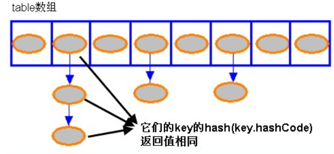
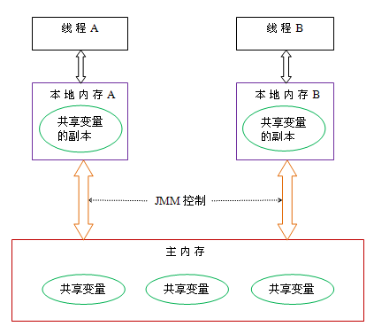
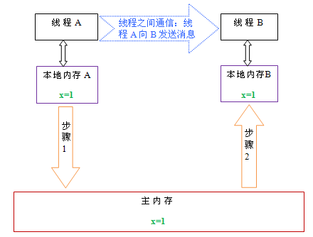
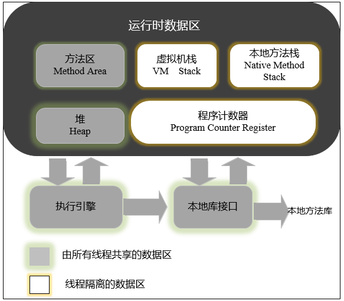
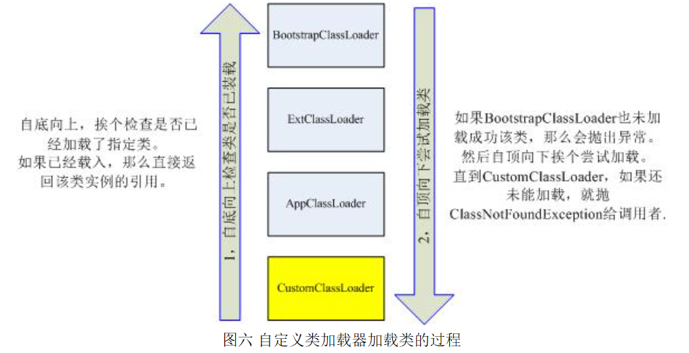
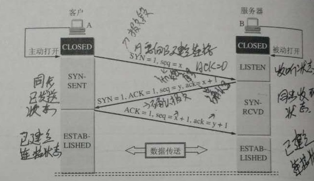

# 一、Java基础 #
## 面向对象和面向过程的区别 ##
- 面向过程优点：性能高，因为类调用的时候需要实例化，开销比较大；
- 面向对象优点：易维护、易复用、易扩展，因为面向对象有封装、继承、多态的特性，可以设计出低耦合的系统，使系统更加灵活、更加易于维护。

## java的四个基本特性 ##
### 1、抽象 ###
- 把现实中的某一类东西用代码表示，通常叫做类或者接口。
- 抽象包括两个方面：数据抽象--对象的域，过程抽象--对象的方法。
### 2、封装： ###
- 把客观事物抽象成类，类的域和方法只让可信的类或者对象操作，对不可信的隐藏。
- 封装分为域的封装和方法的封装。
### 3、 继承： ###
- 把拥有共同特性的多个类抽象成一个类，这个类是他们的父类，这些类继承这个父类。
- 父类的意义在于抽取多类事物的共性。
### 4、 多态： ###
- 允许不同类的对象对同一消息（方法调用）做出响应。即同一消息可以根据发送对象的不同而采取不同的行为方式。
- 实现技术：动态绑定--根据实例的运行期类型调用相应的方法。
- 作用：消除类型之间的耦合。
- 必要条件：继承、重写、父类引用指向子类的对象。

## 重载和重写的区别 ##
- 重载：在同一个类中，方法名相同，参数列表不同，返回值和访问修饰符可以不同也可以相同，发生在编译时。
- 重写：在父子类中，方法名和参数列表相同。 
  类型范围：子类返回值类型<=父类返回值类型（不包括基本类型），子类抛出异常<=父类抛出异常，子类访问修饰符>=父类访问修饰符（如果父类方法的访问修饰符为private，则子类中就不是重写）。

## 构造函数 ##
- Constructor不能被override，不能用static修饰。

## 访问控制符的区别 ##
- public:任何类。
- protected:本类、同包的类、子类。
- default:本类、同包的类。
- private:本类。

## Static关键字 ##
- static主要有4中使用情况：成员变量、成员方法、初始化块和内部类。
- 被修饰的属于类，而不是属于对象。

## final关键字 ##
 - 修饰类，那么这个类不能被继承。
 - 修饰方法，那么这个方法不能被override。
 - 修饰属性，那么这个属性值不能被修改。
 - 在匿名类中所有变量都必须是final变量。
 - final成员变量必须在声明的时候初始化或者在构造器中初始化，否则就会报编译错误。
 - 对于集合对象声明为final指的是引用不能被更改，但是你可以向其中增加，删除或者改变内容。

## String,StringBuffer,StringBuilder的区别 ##
### 1、可变性 ###
- String中使用final char value[]，不可变。
- StringBuffer,StringBuilder继承AbstractStringBuilder使用char[] value，可变。
### 2、线程安全性 ###
- String不可变，线程安全。
- StringBuffer对方法使用同步锁，线程安全。
- StringBuilder没有对方法加同步锁，非线程安全。
### 3、性能 ###
- String每次改变时都会生成一个新的String对象。
- StringBuffer,StringBuilder只是对象本身操作，StringBuilder性能比StringBuilder高10%。

## equals()和==的区别 ##
 - equals()是方法，==是操作符。
 - 使用==比较原生类型如：boolean、int、char等等，使用equals()比较对象。
 - ==返回是否两个引用指向相同的对象，equals()的返回结果依赖于具体业务实现。
 - 字符串的对比使用equals()代替==操作符。

## hashCode和equals的关系 ##
- equals相等-->hashcode相等。
- 重写equals时一定要重写hashcode，否则在使用hashtable等需要使用hashcode的时候很有可能会出问题（contain函数在hashcode相同的bucket中查找是否存在equals的对象）。
- 使用HashMap，如果key是自定义的类，就必须重写hashcode()和equals()。 
- [http://blog.csdn.net/tuolaji8/article/details/48417031](http://blog.csdn.net/tuolaji8/article/details/48417031)
### 如何重写 ###
	//user类
    public class User{    
	    private String name;
	    private int age;
	    private String passport;
	
		//getters and setters, constructor
	}

	User user1 = new User("mkyong", 35, "111222333");
    User user2 = new User("mkyong", 35, "111222333");
	//比较结果
    System.out.println(user1.equals(user2)); // false

	//经典方式
	public class User {
	    private String name;
	    private int age;
	    private String passport;
	    //getters and setters, constructor
	    @Override
	    public boolean equals(Object o) {
	        if (o == this) return true;
	        if (!(o instanceof User)) {
	            return false;
	        }
	        User user = (User) o;
	        return user.name.equals(name) &&
	                user.age == age &&
	                user.passport.equals(passport);
	    }
	    //Idea from effective Java : Item 9
	    @Override
	    public int hashCode() {
	        int result = 17;
	        result = 31 * result + name.hashCode();
	        result = 31 * result + age;
	        result = 31 * result + passport.hashCode();
	        return result;
	    }
	}
	
	//对于JDK7及更新版本，你可以是使用java.util.Objects 来重写 equals 和 hashCode 方法，代码如下
	import java.util.Objects;

	public class User {
	    private String name;
	    private int age;
	    private String passport;
	
	    //getters and setters, constructor
	
	    @Override
	    public boolean equals(Object o) {
	        if (o == this) return true;
	        if (!(o instanceof User)) {
	            return false;
	        }
	        User user = (User) o;
	        return age == user.age &&
	                Objects.equals(name, user.name) &&
	                Objects.equals(passport, user.passport);
	    }
	
	    @Override
	    public int hashCode() {
	        return Objects.hash(name, age, passport);
	    }
	
	}

## 抽象类和接口的区别 ##
### 1、设计理念 ###
- abstarct class体现继承关系，父类和子类在概念本质上相同。
- interface的实现者仅仅实现interface定义的契约。
### 2、语法 ###
- 语言

 		abstract class A {
    		abstract void method();
    	}
    	interface A {
    		void method();
    	}
	   
- 一个类只能继承一个abstract class，但可以实现多个interface。
- interface只能够有public static final的域（interface中一般不定义域），所有方法都是public abstract的。
- abstract class可以有非static域和非static方法。

## 自动装箱和拆箱 ##
- 装箱：将基本类型用对应的包装类包类型。
- 拆箱：将包装类型转换为基本数据类型。
- java编译器会在编译器根据语法决定是否装箱和拆箱。

## 什么是泛型，为什么使用，什么是类型擦除 ##
- 泛型：参数化类型，适用于多种类型。
- 使用：创建集合时就指定元素的类型，该集合只能保存制定类型的元素。
- 类型擦除：java编译器生成的字节码不包含泛型类型信息，类型信息在编译处理时被擦除，用最顶级的父类类型替换。

## java中集合类的关系 ##
- List,Set,Queue接口继承自Collection接口。
- Set无序、元素不重复，主要实现类有HashSet（底层用hashmap实现，基于哈希表）和TreeSet（红黑树）
- List有序、元素可重复，主要实现类有ArrayList,LinkedList,Vector。
- Map和Collection接口无关，Map是key对value的映射集合,key不能重复，value可以重复，主要实现类有HashMap,TreeMap,HashTable。

## HashMap实现原理 ##

- HashMap 实际上是一个链表的数组。
- 如果两个 Entry 的 key 的 hashCode() 返回值相同，那它们的存储位置相同。如果这两个 Entry 的 key 通过 equals 比较返回 true，新添加 Entry 的 value 将覆盖集合中原有 Entry 的 value，但 key 不会覆盖;如果这两个 Entry 的 key 通过 equals 比较返回 false，新添加的 Entry 将与集合中原有 Entry 形成 Entry 链，而且新添加的 Entry 位于 Entry 链的头部。 
出自：[http://blog.csdn.net/caihaijiang/article/details/6280251](http://blog.csdn.net/caihaijiang/article/details/6280251)
- get方法，两个key的hashcode,equals都要相等。hashcode确定在哪个桶，equals确定桶中的位置。
- 当一个map填满了75%(load factor)的bucket时候，将会创建原来HashMap大小的两倍的bucket数组(Entry[] newTable=new Entry[newCapacity])，在调整大小的过程中，存储在LinkedList中的元素的次序会反过来（为了加快扩容时的速度，如果要正序，那么需要每次都遍历到一个entry链表的最后一个entry）。在多线程情况下，重新调整大小可以会产生条件竞争。
- 负载因子指的是table数组的负载比例，与entry链无关，初始的table数组的大小是16，负载因子是0.75.也就是说，当table数组中有16*0.75个位置被占用后，就需要扩容。
- JDK1.8中的HashMap,[http://blog.csdn.net/qq_34483204/article/details/72546571](http://blog.csdn.net/qq_34483204/article/details/72546571)
- [HashMap的工作原理](http://www.admin10000.com/document/3322.html)
- [深入Java集合学习系列：HashMap的实现原理](http://zhangshixi.iteye.com/blog/672697)

### HashMap 的高性能需要保证以下几点： ###
1. Hash 算法必须是高效的。
2. Hash 值到内存地址 (数组索引) 的算法是快速的。
3. 根据内存地址 (数组索引) 可以直接取得对应的值。

### HashMap 的一个功能缺点是它的无序性： ###
- LinkedHashMap（继承自 HashMap）、TreeMap有序。
- LinkedHashMap 是根据元素增加或者访问的先后顺序进行排序（同时在 - HashMap 的基础上，又在内部增加了一个链表，用以存放元素的顺序。），而 TreeMap 则根据元素的 Key 进行排序。

### 为什么String, Integer这样的wrapper类适合作为键 ###
- 因为String,Integer是final不可变的，而且已经重写了equals()和hashCode()方法了。

## HashTable实现原理 ##
- [Java 集合系列11之 Hashtable详细介绍(源码解析)和使用示例](http://www.cnblogs.com/skywang12345/p/3310887.html)
- [Hashtable源码剖析](http://blog.csdn.net/chdjj/article/details/38581035)

## HashMap和HashTable的区别 ##
- 线程安全：HashTable线程安全，HashMap非线程安全。
- key值：HashTable不允许有null(key和value)，HashMap允许null(key和value)。
- 方法：HashTable多出一个contains方法，与containsValue功能一样，而不是containsKey。
- 迭代器：HashTable用Enumeration遍历；HashMap用Iterator遍历。
- 数组大小：HashTable中数组默认大小11，增加方式old*2+1；HashMap中数组默认大小16，增加方式<<1。
- hashcode：HashTable直接使用对象的hashCode；HashMap重新计算hash值，并且用与代替求模。

### 相关 ###
- Enumeration:只能读取不能修改，不支持fail-fast机制。
- Iterator：能读取能删除，支持fail-fast机制。
- fail-fast机制：当线程A通过iterator遍历集合时，若集合的内容被其他线程改变，那么线程A就会抛出异常，即产生fail-fast事件。
- [http://blog.csdn.net/caihaijiang/article/details/6280251](http://blog.csdn.net/caihaijiang/article/details/6280251 "http://blog.csdn.net/caihaijiang/article/details/6280251")
- [http://alex09.iteye.com/blog/539549](http://alex09.iteye.com/blog/539549 "http://alex09.iteye.com/blog/539549")

## HashSet 与 TreeSet 的比较 ##
- HashSet是基于 HashMap 实现的，放入 HashSet 中的集合元素实际上由 HashMap 的 key 来保存，而 HashMap 的 value 则存储了一个 PRESENT，它是一个静态的 Object 对象。
- TreeSet是依靠TreeMap来实现的，TreeSet是一个有序集合，TreeSet中的元素将按照升序排列，缺省是按照自然排序进行排列，意味着TreeSet中的元素要实现Comparable接口。或者有一个自定义的比较器。

## ArrayList和Vector区别 ##
- Vector线程安全，ArrayList非线程安全。
- 初始容量都是10，自动扩容时，Vector增长1倍，ArrayList增长1/2。

## ArrayList和LinkedList的区别 ##
### 区别 ###
- ArrayList底层数组实现，可以随机查找。
- LinkedList底层双向链表实现，增删速度快。实现Queue接口。
### 场景 ###
- LinkedList适合从中间插入或删除。
- ArrayList适合检索和在末尾插入或删除。

## Collection和Collections的区别 ##
- Collection是一个接口，提供对集合对象基本操作的通用接口方法。
- Collections是一个类，包含集合操作的静态方法。该类不能实例化(因为它的构造函数被private修饰)。
- Collections.sort(List<T> list);

## ConcurrenthashMap和hashtable的区别 ##
- Hashtable的synchronized是针对整张表，Concurrenthashmap使用多个锁控制对表不同部分的修改。
- [Java集合---ConcurrentHashMap原理分析](http://www.cnblogs.com/ITtangtang/p/3948786.html)
- [ConcurrentHashMap](http://ifeve.com/concurrenthashmap/)

## Error、Exception异同 ##
- Error和Exception都继承tThrowable。
- Error类一般指与虚拟机相关的问题，比如系统崩溃，虚拟机错误，内存空间不足，方法调用栈溢出。这类错误导致的应用程序中断仅靠程序本身无法恢复和预防，应该终止程序。
- Exception类表示程序可以处理的异常，可以捕获并且可能恢复。这类异常应该尽可能处理。

## 21、checked和unchecked异常##
### unchecked Exception ###
- 通常是自身的问题。
- 程序瑕疵或者逻辑错误，运行时无法恢复。
- 包括Error和RuntimeException及其子类。（比如：NullPointerException,没有人特意去处理）
- 语法上不需要抛出异常。
### checked Exception ###
- 程序不能直接控制的无效外界情况（用户输入，数据库问题，网络异常，文件丢失）。
- 除了Error和RuntimeException及其子类之外的类。
- 需要try catch处理或者throws抛出异常。

## java如何实现代理机制 ##
- 代理模式：为其他对象提供一种代理，以控制对这个对象的访问。
- [http://blog.csdn.net/heyutao007/article/details/49738887](http://blog.csdn.net/heyutao007/article/details/49738887 "http://blog.csdn.net/heyutao007/article/details/49738887")
### jdk动态代理 ###
- 使用反射实现。代理类和委托类实现了共同nvocationHandler接口。
### cglib动态代理 ###
- 使用ASM在内存中动态的生成被代理类的子类。代理类实现MethodInterceptor接口。

## 23、多线程的实现方式 ##
- Thread + Runnable。（thread.start()）
- ExecutorService + Runable，不返回值。
- ExecutorService + Callable，返回Future。
 
	    public class ThreadEx {
	    	public static void main(String[] args) throws InterruptedException, ExecutionException {
	    		Thread thread = new Thread(new Runnable() {
	    
	    			@Override
	    			public void run() {
	    				// TODO Auto-generated method stub
	    
	    			}
	    		});
	    		thread.start();
	    
	    		ExecutorService executorService = Executors.newCachedThreadPool();
	    		executorService.execute(new Runnable() {
	    
	    			@Override
	    			public void run() {
	    				// TODO Auto-generated method stub
	    
	    			}
	    		});
	    		//submit方法有返回值，即call()方法的返回值
	    		Future<Integer> future = executorService.submit(new Callable<Integer>() {
	    
	    			@Override
	    			public Integer call() throws Exception {
	    				// TODO Auto-generated method stub
	    				return 1;
	    			}
	    		});
	    		System.out.println(future.get());
	    		executorService.shutdown();
	    	}
	    }
### runnable和callable的区别 ###
1. Callable规定的方法是call()，而Runnable规定的方法是run(). 
2. Callable的任务执行后可返回值，而Runnable的任务是不能返回值的
3. call()方法可抛出异常，而run()方法是不能抛出异常的。 
4. 运行Callable任务可拿到一个Future对象，Future表示异步计算的结果。

## 线程状态 ##

1. 新建状态：new Thread()。
2. 就绪状态：tread.start()。
3. 运行状态：获得CPU时间后执行run()。
4. 阻塞状态：例如sleep，io。
5. 死亡状态：run正常退出；未捕获异常终止run。 
[http://blog.csdn.net/peter_teng/article/details/10197785](http://blog.csdn.net/peter_teng/article/details/10197785 "http://blog.csdn.net/peter_teng/article/details/10197785")

## 线程阻塞的原因 ##
- 线程执行了Thread.sleep(int millsecond)方法，当前线程放弃CPU，睡眠一段时间，然后再恢复执行。
- 线程执行了一个对象的wait()方法，直接进入阻塞状态，等待其他线程执行notify()或者notifyAll()方法。
- 线程执行一段同步代码，但是尚且无法获得相关的同步锁，只能进入阻塞状态，等到获取了同步锁，才能回复执行。
- 线程执行某些IO操作，因为等待相关的资源而进入了阻塞状态。比如说监听system.in，但是尚且没有收到键盘的输入，则进入阻塞状态。

## 如何终止一个线程 ##
1. 线程里面是一个循环。设置一个标志位，在循环检查的时候跳出循环。
2. 线程因为sleep,wait,join(thread1.join()主线程会等待thread1运行结束后，才会继续向下运行)等阻塞或者挂起的时候。使用interrupt，产生InterruptedException异常，从而跳出线程。

## 什么是线程安全 ##
- 多个线程可能会同时运行一段代码，每次运行的结果和单线程运行的结果是一样的，而且其他变量的值也和预期的是一样的。
- 《Java Concurrency In Practice》：当多个线程访问同一个对象时，如果不用考虑这些线程在运行时环境下的调度和交替执行，也不需要进行额外的同步，或者调用方法进行任何其他的协调操作，调用这个对象的行为都可以获得正确的结果，那这个对象就是线程安全的。

## 如何保证线程安全 ##
- 对非安全的代码进行加锁，synchronized,volatile,lock等。
- 使用线程安全的类。
- 多线程并发情况下，线程共享的变量改为方法级的局部变量。

## 38、volatile关键字 ##
- volatile具有可见性：修饰的成员变量在每次被线程访问时，都强迫从共享内存中重读该成员变量的值。而且，当成员变量发生变化时，强迫线程将变化值回写到共享内存。这样在任何时刻，两个不同的线程总是看到某个成员变量的同一个值。
- volatile不具有原子性：允许超过一个线程访问该数据。(原子性：就是某系列的操作步骤要么全部执行，要么都不执行，eg:i++分为三个步骤执行，所以仅靠volatile不能保证线程的安全性)
- 要使volatile提供理想的线程安全，必须同时满足两个条件：1、对变量的写操作不依赖于当前值；2、该变量没有包含在具有其他变量的不变式中。

### 原理 ###

- volatile主要用在多个线程感知实例变量被更改了场合，从而使得各个线程获得最新的值。它强制线程每次从主内存中读到volatile修饰的变量，而不是从线程的私有内存中读取变量，从而保证了数据的可见性。
- 从图中可以看出： 
①每个线程都有一个自己的本地内存空间。线程执行时，先把变量从主内存读取到线程自己的本地内存空间，然后再对该变量进行操作(volatile强制线程从主内存中取 volatile修饰的变量)。 
②对该变量操作完后刷新回主内存。
### 参考 ###
[http://blog.csdn.net/feier7501/article/details/20001083](http://blog.csdn.net/feier7501/article/details/20001083 "http://blog.csdn.net/feier7501/article/details/20001083")

## synchronized如何使用 ##
### 使用synchronized同步方法和域 ###
- 静态方法或域，需要获得类锁。
- 非静态方法或域，需要获得对象锁。
### 使用synchronized同步代码段 ###
- synchronized(类.class){}，需要获得类锁。
- synchronized(this,其他对象)，需要获得对象锁

## synchronized和Lock的区别 ##
- Lock能完成synchronized所实现的所有功能。
- Lock的锁定是通过代码实现的，synchronized是在JVM层次上实现的
- Lock需要手动在finally从句中释放锁，synchronized自动释放锁。
- Lock可以通过tryLock方法用非阻塞方式去拿锁。
- Lock锁的范围：代码块；synchronized锁的范围：代码块，对象，类。

## volatile 与 synchronized 的比较 ##
 - volatile轻量级，只能修饰变量。synchronized重量级，还可修饰方法
 - volatile只能保证数据的可见性，不能用来同步，因为多个线程并发访问volatile修饰的变量不会阻塞。
 - synchronized不仅保证可见性，而且还保证原子性，因为，只有获得了锁的线程才能进入临界区，从而保证临界区中的所有语句都全部执行。多个线程争抢synchronized锁对象时，会出现阻塞。

## 多线程如何进行信息交互 ##
- wait(long timeout)：挂起线程，释放对象锁，直到时间到期或其他线程调用该对象的notify(),notifyAll()。
- wait()：挂起线程，释放对象锁，直到其他线程调用该对象的notify(),notifyAll()。
- notify()：唤醒该对象上wait的单个线程。
- notifyAll()：唤醒该对象上wait的所有线程。

## sleep和wait的区别 ##
- sleep是Thread中的方法，wait是Object中的方法。
- sleep：线程不会释放对象锁；wait：线程释放对象锁。

## 产生死锁的必要条件 ##
1. 互斥条件：进程使用的资源中至少有一个不能共享。
2. 请求与保持条件：进程因为请求资源阻塞时，保持已获得的资源。
3. 不剥夺条件：进程已获得的资源在未使用完之前不能被强行剥夺。
4. 循环等待条件：A等待B的资源，B等待C的资源，直到某个进程等待A的资源，使得所有进程都无法继续。
### 死锁例子 ###
[http://blog.csdn.net/qq_35064774/article/details/51793656](http://blog.csdn.net/qq_35064774/article/details/51793656)

## 死锁的预防 ##
### 打破产生死锁的四个必要条件中的一个或几个 ###
1. 互斥条件：允许进程同时访问某些资源，但是有的资源不允许同时访问，比如打印机。该方法无实用价值。
2. 请求与保持条件：实行资源预分配策略，即进程在运行前一次性的向系统申请所需要的全部资源。如果某个资源得不到满足，则不分配资源，进程阻塞；只有满足进程的全部资源需求时，才一次性的将所申请的资源全部分配给该进程。
3. 不剥夺条件：允许进程强行从占有者那里夺取资源，即一个进程拥有某些资源，但是新申请的资源不能立刻满足，该进程必须释放所占有的全部资源。该方法实现困难，会降低性能。
4. 循环等待条件：实行资源有序分配策略，即把资源事先编号，所有进程请求资源先编号小的再编号大的，这样就不会产生环路。

## 守护进程是什么，如何实现 ##
- 程序运行时在后台提供一种通用服务的线程，当非后台线程结束时，程序也就终止，同时杀死进程中的所有后台线程。
- setDaemon(true)。

## java线程池技术及原理 ##
### 原因 ###
- 如果并发的线程数量很多，并且每个线程执行一个时间很短的任务就结束，这样频繁创建线程会大大降低系统的效率。
- 使用线程池可以使得线程复用，即线程执行完一个任务不被销毁而是继续执行其他任务。
#### 底层实现####
- ThreadPoolExecutor类。
### 任务处理策略 ###
- 线程池中的当前线程数poolSize。
- poolSize<corePoolSize，则每来一个任务，就创建一个线程执行这个任务。
- poolSize>=corePoolSize，则每来一个任务，则添加到任务缓存队列。添加成功（一般队列未满），则该任务会等待空闲线程将其取出执行；添加失败（一般是缓存队列已满）且poolSize<maximumPoolSize，则创建新的线程执行这个任务。
- poolSize>=maximumPoolSize，则采取任务拒绝策略。
- 线程的存活时间：poolSize>corePoolSize，如果某线程空闲时间超过keepAliveTime,线程将被终止，直到poolSize<=corePoolSize；如果允许设置核心池中的存活时间，核心池中的线程空闲时间超过keepAliveTime，该线程也会被终止。
- [Java并发编程：线程池的使用](http://www.cnblogs.com/dolphin0520/p/3932921.html)
### java的四种线程池 ###
1. newSingleThreadExecutor 
创建一个单线程的线程池。这个线程池只有一个线程在工作，也就是相当于单线程串行执行所有任务。如果这个唯一的线程因为异常结束，那么会有一个新的线程来替代它。此线程池保证所有任务的执行顺序按照任务的提交顺序执行。
2. newFixedThreadPool 
创建固定大小的线程池。每次提交一个任务就创建一个线程，直到线程达到线程池的最大大小。线程池的大小一旦达到最大值就会保持不变，如果某个线程因为执行异常而结束，那么线程池会补充一个新线程。
3. newCachedThreadPool 
创建一个可缓存的线程池。如果线程池的大小超过了处理任务所需要的线程，
那么就会回收部分空闲（60秒不执行任务）的线程，当任务数增加时，此线程池又可以智能的添加新线程来处理任务。此线程池不会对线程池大小做限制，线程池大小完全依赖于操作系统（或者说JVM）能够创建的最大线程大小。
4. newScheduledThreadPool 
创建一个大小无限的线程池，支持定时以及周期性执行任务的需求。
5. 参考 [http://blog.csdn.net/u011974987/article/details/51027795](http://blog.csdn.net/u011974987/article/details/51027795 "http://blog.csdn.net/u011974987/article/details/51027795") [http://blog.csdn.net/linghu_java/article/details/17123057](http://blog.csdn.net/linghu_java/article/details/17123057 "http://blog.csdn.net/linghu_java/article/details/17123057")

## java并发包oncurrent及常用类 ##
- 线程池（36），[锁](http://www.cnblogs.com/dolphin0520/p/3923167.html)，[集合
](http://www.cnblogs.com/huangfox/archive/2012/08/16/2642666.html)

## JAVA中的NIO,BIO,AIO分别是什么 ##
### 几个概念 ###
- 同步：使用同步IO时，java自己处理IO读写。
- 异步：使用异步IO时，java将IO读写委托给OS处理，需要将缓冲区地址和大小传给OS，OS需要支持异步IO操作API。
- 阻塞：使用阻塞IO时，java调用会一直阻塞到读写完成后才返回。
- 非阻塞：使用非阻塞IO时，当IO事件分发器通知可读写时继续读写，不可读写时进行其他操作，不断循环直到读写完成。
### BIO ###
- 同步阻塞。
- 服务器实现模式为一个连接一个线程，即客户端有连接请求时服务器端就需要启动一个线程进行处理，如果这个连接不做任何事情会造成不必要的线程开销，可以通过线程池机制改善。
- 适合链接数目较小且固定的架构。
### NIO ###
- 同步非阻塞。
- 服务器实现模式为一个请求一个线程，即客户端发送的连接请求都会注册到多路复用器上，多路复用器轮询到连接有IO请求是才启动一个线程进行处理。
- 适合链接数目较多且比较短（轻操作）的架构，比如聊天服务器，jdk1.4开始支持。
### AIO ###
- 异步非阻塞。
- 服务器实现模式为一个有效请求一个线程，客户端的IO请求都是有OS完成后再通知服务器应用去启动线程处理。
- 适用于链接数目多且连接较长（重操作）的架构，比如相册服务器，jdk1.7开始。
### 详细 ###
[http://blog.csdn.net/skiof007/article/details/52873421](http://blog.csdn.net/skiof007/article/details/52873421)

## IO和NIO区别 ##
1. IO面向流，NIO面向缓冲区。
2. IO阻塞，NIO非阻塞。
3. NIO的选择器允许一个单独的线程来监视多个输入通道。

## 序列化和反序列化 ##
### 定义 ###
- 序列化：把对象转换为字节序列。
- 反序列化：字节序列恢复为对象。
### 用途 ###
- 把对象的字节序列永久的保存在硬盘上，通常放在一个文件里。
- 在网络上传送对象的字节序列，因为无论何种类型的数据，都会以二进制序列的形式在网络上传输。
- 深复制。
### 深复制 ###
    @Override
	public Graph clone() {
		try {
			// 序列化
			ByteArrayOutputStream bos = new ByteArrayOutputStream();
			ObjectOutputStream oos = new ObjectOutputStream(bos);

			oos.writeObject(this);

			// 反序列化
			ByteArrayInputStream bis = new ByteArrayInputStream(bos.toByteArray());
			ObjectInputStream ois = new ObjectInputStream(bis);

			return (Graph) ois.readObject();
		} catch (ClassNotFoundException e) {
			e.printStackTrace();
		} catch (IOException e) {
			e.printStackTrace();
		}
		return null;
	}

## Java内存模型 ##
### 概念 ###
- JMM，Java Memory Model，定义JVM在计算机内存(RAM)中的工作方式。
- JVM是整个计算机的虚拟模型，所以JMM隶属于JVM。

### 抽象模型 ###
#### 模型 ####
- 线程之间的共享变量储存在主内存中。
- 每个线程都有一个私有的本地内存，储存了该线程读写共享变量的副本。
- 本地内存是一个抽象概念，涵盖缓存、写缓冲区、寄存器、其他硬件和编译器优化

#### 通信的实现 ####
1. 首先，线程A把本地内存A中更新过的共享变量刷新到主内存中去。
2. 然后，线程B到主内存中去读取线程A之前已更新过的共享变量。 

### JVM对java内存模型的实现 ###
- 程序计数器：指向当前所执行的字节码。
- java虚拟机栈：执行java方法服务，储存局部变量、操作数栈、动态链接、方法出口等。
- 本地方法栈：类似java虚拟机栈，但执行Native方法。
- java堆：存放对象实例。
- 方法区：存储已被虚拟机加载的类信息、常量、静态变量、即时编译器变异后的代码等。

### 硬件内存模型 ###
- CPU寄存器、CPU缓存、主存。

### JMM和硬件的关系 ###
- 交叉关系。

### 参考 ###
- [http://blog.csdn.net/suifeng3051/article/details/52611310#t5](http://blog.csdn.net/suifeng3051/article/details/52611310#t5)
- [http://www.jb51.net/article/84235.htm](http://www.jb51.net/article/84235.htm)

## 内存溢出和内存泄漏 ##
- 内存溢出：程序在申请内存时，没有足够的内存空间。除了程序计数器都有可能OOM。
- 内存泄漏：分配出去的内存不再使用，但是没有回收。由于长生命周期对象引用了短生命周期对象。

## java内存模型及各个区域的OOM，如何重现OOM ##
[JVM内存管理：深入Java内存区域与OOM](http://hllvm.group.iteye.com/group/wiki/2857-JVM)

## 出现OOM如何解决 ##
1. 可通过命令定期抓取heap dump或者启动参数OOM时自动抓取heap dump文件。
2. 通过对比多个heap dump，以及heap dump的内容，分析代码找出内存占用最多的地方。
3. 分析占用的内存对象，是否是因为错误导致的内存未及时释放，或者数据过多导致的内存溢出。

## javaGC机制 ##
#### “自适应的、分代的、停止-复制、标记清扫”式垃圾回收器 ####
### java内存分配 ###
- java堆分配的实现更像传送带，每份配一个新对象，就往前移动一格，“堆指针”只是简单的移动到尚未分配的区域。
- 垃圾回收器一面回收空间，一面使堆中的对象紧凑排列，从而实现了一种高速的、有无限空间可供分配的堆模型。
### 自适应的 ###
- JVM会进行监视，如果所有对象很稳定，切换到“标记-清扫”和“标记-整理”的混合方式；如果堆空间出现很多碎片，切换到“停止-复制”方式。
### 分代的 ###
- 内存分配以块为单位，每个块用代数来记录是否存活（从旧堆复制到新堆会导致大量内存复制的行为）。如果块在某处被引用，其代数增加；垃圾回收器将对上次回收动作之后新分配的块整理。垃圾回收器会定期进行完整的清理--大型对象不会被复制（只是代数增加），内含小型对象的块则被复制并整理。
### 停止-复制 ###
- 暂停程序（不是后台回收），从堆栈和静态存储区出发，遍历所有引用，找出所有存活的对象，从当前堆复制到另一个堆，没有复制的都是垃圾。当对象被复制到新堆的时候，它们紧挨着，所以新堆保持紧凑排列。
### 标记-清扫 ###
- 从堆栈和静态存储区出发，遍历所有引用，找出所有存活的对象，给对象设一个标记，当标记工作全部完成时，释放没有标记的对象。不发生复制动作，所以剩下的堆空间是不连续的。
### 标记-整理 ###
- 类似标记清扫，但是不直接清理，而是让所有可用的对象都向一端移动。然后直接清理掉边界意外的内存。
### 参考 ###
- [Java 内存区域和GC机制](http://www.cnblogs.com/hnrainll/archive/2013/11/06/3410042.html)
- [http://blog.csdn.net/u010841296/article/details/50945390](http://blog.csdn.net/u010841296/article/details/50945390 "http://blog.csdn.net/u010841296/article/details/50945390")

## java类加载器如何加载类 ##
### 初始化顺序 ###
1. 父类的静态域和静态初始化块（按照声明的先后顺序初始化）。
2. 子类的静态域和静态初始化块（同上）。
3. 父类的实例域和实例初始化块。
4. 父类的构造方法。
5. 子类的实例域和实例初始化块。
6. 子类的构造方法。
### 类加载器 ###
- [http://blog.csdn.net/zhoudaxia/article/details/35824249](http://blog.csdn.net/zhoudaxia/article/details/35824249 "http://blog.csdn.net/zhoudaxia/article/details/35824249")

## 73、类的加载机制和双亲委派机制 ##
### 1. JVM三种预定义类型类加载器 ###
- 启动（Bootstrap）类加载器：负责加载 <Java_Runtime_Home>/lib下面的核心类库；开发者无法直接获取到启动类加载器的引用
- 扩展（Extension）类加载器：负责加载< Java_Runtime_Home >/lib/ext下的类库
- 系统（System）类加载器：

### 2. 类加载双亲委派机制 ###
 - 通俗的讲，就是某个特定的类加载器在接到加载类的请求时，首先将加载任务委托给父类加载器，依次递归，如果父类加载器可以完成类加载任务，就成功返回；只有父类加载器无法完成此加载任务时，才自己去加载。
 - 类加载器可以分为两类：一是引导类装载器（c++实现，非ClassLoader的实例，用于加载java类库中的类）；二是自定义类装载器（即所有继承了java.lang.ClassLoader的类加载器，它们本身是由引导类装载器装载进jvm的）.
 - 类加载器均是继承自java.lang.ClassLoader抽象类。我们下面我们就看简要介绍一下java.lang.ClassLoader中几个最重要的方法：
 - 
		 //加载指定名称（包括包名）的二进制类型，供用户调用的接口
		public Class<?> loadClass(String name) throws ClassNotFoundException{ … }
		
		//加载指定名称（包括包名）的二进制类型，同时指定是否解析（但是这里的resolve参数不一定真正能达到解析的效果），供继承用
		protected synchronized Class<?> loadClass(String name, boolean resolve) throws ClassNotFoundException{ … }
		
		//findClass方法一般被loadClass方法调用去加载指定名称类，供继承用
		protected Class<?> findClass(String name) throws ClassNotFoundException { … }
		
		//定义类型，一般在findClass方法中读取到对应字节码后调用，可以看出不可继承
		//（说明：JVM已经实现了对应的具体功能，解析对应的字节码，产生对应的内部数据结构放置到方法区，所以无需覆写，直接调用就可以了）
		protected final Class<?> defineClass(String name, byte[] b, int off, int len) throws ClassFormatError{ … }

- 标准扩展类加载器和系统类加载器的代码以及其公共父类的代码可以看出，**都没有覆写java.lang.ClassLoader中默认的加载委派规则---loadClass（…）方法。**既然这样，我们就可以通过分析java.lang.ClassLoader中的loadClass（String name）方法代码就可以分析出虚拟机默认采用的双亲委派机制到底是什么模样：

		public Class<?> loadClass(String name) throws 	ClassNotFoundException {
	        return loadClass(name, false);
	    }

	    protected synchronized Class<?> loadClass(String name, boolean resolve)
	            throws ClassNotFoundException {
	
	        // 首先判断该类型是否已经被加载
	        Class c = findLoadedClass(name);
	        if (c == null) {
	            //如果没有被加载，就委托给父类加载或者委派给启动类加载器加载
	            try {
	                if (parent != null) {
	                    //如果存在父类加载器，就委派给父类加载器加载
	                    c = parent.loadClass(name, false);
	                } else {
	                    //如果不存在父类加载器，就检查是否是由启动类加载器加载的类，
	                    //通过调用本地方法native findBootstrapClass0(String name)
	                    c = findBootstrapClass0(name);
	                }
	            } catch (ClassNotFoundException e) {
	                // 如果父类加载器和启动类加载器都不能完成加载任务，才调用自身的加载功能
	                c = findClass(name);
	            }
	        }
	        if (resolve) {
	            resolveClass(c);
	        }
	        return c;
	    }	

- **系统类加载器的父加载器是标准扩展类加载器，标准扩展类加载器本身强制设定父类加载器为null。**系统类加载器（AppClassLoader）调用ClassLoader(ClassLoader parent)构造函数将父类加载器设置为标准扩展类加载器(ExtClassLoader)。扩展类加载器（ExtClassLoader）调用ClassLoader(ClassLoader parent)构造函数将父类加载器设置为null。我们首先看一下java.lang.ClassLoader抽象类中默认实现的两个构造函数：

	    protected ClassLoader() {
	        SecurityManager security = System.getSecurityManager();
	        if (security != null) {
	            security.checkCreateClassLoader();
	        }
	        //默认将父类加载器设置为系统类加载器，getSystemClassLoader()获取系统类加载器
	        this.parent = getSystemClassLoader();
	        initialized = true;
	    }
	
	    protected ClassLoader(ClassLoader parent) {
	        SecurityManager security = System.getSecurityManager();
	        if (security != null) {
	            security.checkCreateClassLoader();
	        }
	        //强制设置父类加载器
	        this.parent = parent;
	        initialized = true;
	    }

### 3. java程序动态扩展方式 ###
Java的连接模型允许用户运行时扩展引用程序，既可以通过当前虚拟机中预定义的加载器加载编译时已知的类或者接口，又允许用户自行定义类装载器，在运行时动态扩展用户的程序。通过用户自定义的类装载器，你的程序可以装载在编译时并不知道或者尚未存在的类或者接口，并动态连接它们并进行有选择的解析。运行时动态扩展java应用程序有如下两个途径：
#### 3.1 调用java.lang.Class.forName(…)加载类 ####
Class.forName的一个很常见的用法就是在加载数据库驱动的时候。如 Class.forName("org.apache.derby.jdbc.EmbeddedDriver").newInstance()用来加载 Apache Derby 数据库的驱动。 

#### 3.2 用户自定义类加载器 ####
- 

### 4. 常见问题分析 ###
#### 4.1 由不同的类加载器加载的指定类还是相同的类型吗？ ####
- 在JVM中一个类用其全名和一个加载类ClassLoader的实例作为唯一标识，不同类加载器加载的类将被置于不同的命名空间。所以不是相同的类型。
#### 4.2 在代码中直接调用Class.forName(String name)方法，到底会触发那个类加载器进行类加载行为？ ####
- Class.forName(String name)默认会使用调用类的类加载器来进行类加载
#### 4.3 在编写自定义类加载器时，如果没有设定父加载器，那么父加载器是谁？ ####
- 在不指定父类加载器的情况下，默认采用系统类加载器
#### 4.4 在编写自定义类加载器时，如果将父类加载器强制设置为null，那么会有什么影响？如果自定义的类加载器不能加载指定类，就肯定会加载失败吗？ ####
- JVM规范中规定如果用户自定义的类加载器将父类加载器强制设置为null，那么会自动将启动类加载器设置为当前用户自定义类加载器的父类加载器（这个问题前面已经分析过了）。
- 即使用户自定义类加载器不指定父类加载器，那么，同样可以加载到<Java_Runtime_Home>/lib下的类，但此时就不能够加载<Java_Runtime_Home>/lib/ext目录下的类了。
#### 4.5 编写自定义类加载器时，一般有哪些注意点？ ####
1. 一般尽量不要覆写已有的loadClass(...)方法中的委派逻辑
2. 如果自定义类加载器，就必须重写findClass方法！将指定名称的类读取为字节数组。但是如何将字节数组转为Class对象呢？很简单，Java提供了defineClass方法，通过这个方法，就可以把一个字节数组转为Class对象啦~

#### 4.6 如何在运行时判断系统类加载器能加载哪些路径下的类？ ####
1. 一是可以直接调用ClassLoader.getSystemClassLoader()或者其他方式获取到系统类加载器（系统类加载器和扩展类加载器本身都派生自URLClassLoader），调用URLClassLoader中的getURLs()方法可以获取到。
2. 二是可以直接通过获取系统属性java.class.path来查看当前类路径上的条目信息 ：System.getProperty("java.class.path")。

- [http://blog.csdn.net/zhoudaxia/article/details/35824249](http://blog.csdn.net/zhoudaxia/article/details/35824249)
- [http://blog.csdn.net/huachao1001/article/details/52297075](http://blog.csdn.net/huachao1001/article/details/52297075)

## Java类的加载过程 ##
### 有且只有以下四种情况必须立即对类进行”初始化”(称为对一个类进行主动引用)： ###

1. 遇到new、getstatic、putstatic、invokestatic这四条字节码指令时(使用new实例化对象的时候、读取或设置一个类的静态字段、调用一个类的静态方法)。
2. 使用java.lang.reflet包的方法对类进行反射调用的时候。
3. 当初始化一个类的时候，如果发现其父类没有进行过初始化，则需要先触发其父类的初始化。
4. 当虚拟机启动时，虚拟机会初始化主类(包含main方法的那个类)。

## 类的生命周期 ##
1. 加载

	- 加载阶段主要完成三件事，即通过一个类的全限定名来获取定义此类的二进制字节流，
	- 将这个字节流所代表的静态存储结构转化为方法区的运行时数据结构，
	- 在Java堆中生成一个代表此类的Class对象，作为访问方法区这些数据的入口。这个加载过程主要就是靠类加载器实现的，这个过程可以由用户自定义类的加载。（虚拟机会在内存中实例化一个java.lang.Class类的对象。对于HotSpot虚拟机，虽然这是一个对象，按理说应该在Java堆中创建，不过HotSpot虚拟机是在方法区中创建的。这个对象将作为程序访问方法区中的这些数据类型的外部入口。）

2. 验证
	- 这个阶段目的在于确保Class文件的字节流中包含信息符合当前虚拟机要求，不会危害虚拟机自身安全

3. 准备
	- 仅仅为类变量(即static修饰的字段变量)分配内存并且设置该类变量的初始值即零值，这里不包含用final修饰的static，因为final在编译的时候就会分配了，同时这里也不会为实例变量分配初始化。类变量会分配在方法区中，而实例变量是会随着对象一起分配到Java堆中。

4. 解析
	- 解析主要就是将常量池中的符号引用替换为直接引用的过程。符号引用就是一组符号来描述目标，可以是任何字面量，而直接引用就是直接指向目标的指针、相对偏移量或一个间接定位到目标的句柄。有类或接口的解析，字段解析，类方法解析，接口方法解析。
　　这里要注意如果有一个同名字段同时出现在一个类的接口和父类中，那么编译器一般都会拒绝编译。

5. 初始化
 - 初始化阶段是执行类构造器方法clinit() 的过程。clinit() 是编译器自动收集类中所有类变量（静态变量）的赋值动作和静态语句块合并生成的。编译器收集的顺序是由语句在源文件中出现的顺序决定的。JVM会保证在子类的clinit() 方法执行之前，父类的clinit() 方法已经执行完毕。
 - 因此所有的初始化过程中clinit()方法，保证了静态变量和静态语句块总是最先初始化的，并且一定是先执行父类clinit()，在执行子类的clinit()。

eg:类变量（静态变量）在准备阶段分配内存（方法区），在初始化阶段被赋值，final static 在编译阶段已分配内存

- [http://blog.csdn.net/sinat_19650093/article/details/50939132](http://blog.csdn.net/sinat_19650093/article/details/50939132)

## 动态加载和静态加载的区别 ##
- new创建对象的方式称作为静态加载，在编译时期加载。
- Class.forName("XXX")称作为动态加载，在编译时期可以缺席（源程序不必存在）。
- [http://blog.csdn.net/geekerhw/article/details/47108437](http://blog.csdn.net/geekerhw/article/details/47108437)

## servlet生命周期及各个方法 ##
- servlet 生命周期：Servlet 加载--->实例化--->服务--->销毁。
- init（）：在Servlet的生命周期中，仅执行一次init()方法。可以配置服务器，以在启动服务器或客户机首次访问Servlet时装入Servlet。
- service（）：它是Servlet的核心，负责响应客户的请求。
- destroy（）： 仅执行一次，在服务器端停止且卸载Servlet时执行该方法。当Servlet对象退出生命周期时，负责释放占用的资源。一个Servlet在运行service()方法时可能会产生其他的线程，因此需要确认在调用destroy()方法时，这些线程已经终止或完成。

## tomcat和servlet工作流程 ##
1. Servlet容器启动时：读取web.xml配置文件中的信息，构造指定的Servlet对象，创建ServletConfig对象，同时将ServletConfig对象作为参数来调用Servlet对象的init方法。
3. Web Client 向Servlet容器（Tomcat）发出Http请求,Servlet容器会判断内存中是否存在指定的Servlet对象，如果没有则创建它（也可以在容器启动时创建）。
4. Servlet容器接收Web Client的请求，Servlet容器创建一个HttpRequest对象，将Web Client请求的信息封装到这个对象中。
5. Servlet容器创建一个HttpResponse对象。
6. Servlet容器调用HttpServlet对象的service方法，把HttpRequest对象与HttpResponse对象作为参数传给 HttpServlet 对象。
7. HttpServlet调用HttpRequest对象的有关方法，获取Http请求信息。
8. 逻辑处理。
8. HttpServlet调用HttpResponse对象的有关方法，生成响应数据。
9. Servlet容器把HttpServlet的响应结果传给Web Client。

## 幂等性 ##
- HTTP方法的幂等性是指一次和多次请求某一个资源应该具有同样的副作用。

## copyOnRight ##
### 概念 ###
- 当我们往一个容器添加元素的时候，不直接往当前容器添加，而是先将当前容器进行Copy，复制出一个新的容器，然后新的容器里添加元素，添加完元素之后，再将原容器的引用指向新的容器。
### 好处 ###
- 我们可以对CopyOnWrite容器进行并发的读，而不需要加锁，因为当前容器不会添加任何元素。
### 思想 ###
- 读写分离。
- [http://ifeve.com/java-copy-on-write/](http://ifeve.com/java-copy-on-write/ "http://ifeve.com/java-copy-on-write/")

# 二、网络 #

## http中GET和POST的区别 ##
### 原理上 ###
 - GET用于信息获取。
 - POST表示可能修改变服务器上的资源的请求。
### 请求数据位置 ###
 - GET请求的数据会附在URL之后的查询字符串中，以?分割URL和传输数据，参数之间以&相连。
 - POST把提交的数据则放置在是HTTP报文的body中，编码方式不限，常用application/x-www-form-urlencoded，application/json，multipart/form-data，text/xml等。
### 请求数据大小 ###
 - 因为GET是通过URL提交数据，而HTTP协议规范没有对URL长度进行限制，但url长度受特定的浏览器及服务器的限制（1024字节）。
 - 理论上讲，POST是没有大小限制的，HTTP协议规范也没有进行大小限制，起限制作用的是服务器处理程序的能力（80K/100K）。
### 安全性 ###
 - 使用GET方法时，浏览器可能会缓存地址等信息，留下历史记录。
 - POST方法则不会进行缓存。
### 效率 ###
- get发送一次报文，post发送两次，get效率高。
- [http://www.oschina.net/news/77354/http-get-post-different](http://www.oschina.net/news/77354/http-get-post-different "http://www.oschina.net/news/77354/http-get-post-different")

## OSI七层模型以及TCP/IP四层模型 ##
 - TCP头：TCP数据报，包含源端和目的端的端口号，用于寻找发端和收端的应用进程；
 - IP头：用于寻找网络中目的主机在逻辑网络中的位置；
 - LLC头：负责识别网络层协议，然后对它们进行封装。LLC报头告诉数据链路层一旦帧被接收到时，应当对数据包做何处理。它的工作原理是这样的：主机接收到帧并查看其LLC报头，以找到数据包的目的地，比如说，在网络层的IP协议。
 - MAC头：用于寻找主机在网络设备中的位置；
 - TCP（传输控制协议，传输效率低，可靠性强，用于传输可靠性要求高，数据量大的数据），UDP（用户数据报协议，与TCP特性恰恰相反，用于传输可靠性要求不高，数据量小的数据，如QQ聊天数据就是通过这种方式传输的）。 
 - [http://www.cnblogs.com/commanderzhu/p/4821555.html](http://www.cnblogs.com/commanderzhu/p/4821555.html)

## TCP三次握手四次挥手##
### 三次握手 ###
 - SYN 1,SEND SEQ x,client SYN_SEND
 - SYN 1,ACK 1,SEND SEQ y,REC SEQ x+1,server SYN_RECV
 - SYN 0,ACK 1,REC SEQ y+1,client+server ESTABLISHED

### 四次挥手 ###
 - SEND SEQ x+2,REC SEQ y+1,client FIN_WAIT_1
 - REC SEQ =SEND SEQ +1,client FIN_WAIT_2
 - SEND SEQ y+1,server LAST_ACK
 - REC SEQ = SEND SEQ+1,client TIME_WAIT server CLOSED client等待2MSL后依然没有回复，则证明服务端已正常关闭，客户端此时关闭连接进入CLOSED状态。

## 为什么建立连接协议是三次握手，而关闭连接却是四次握手 ##
### 三次握手 ###
- 防止A已失效的连接请求传到B，产生错误，所以A需要对B的确认进行确认。
### 四次挥手 ###
- TCP全双工通信，前两次挥手关闭A到B的通信，这个时候B到A仍然可以发送数据。

## TCP为什么TIME_WAIT状态还需要等2MSL(Maximum Segment Lifetime 报文最长存活时间)后才能返回到CLOSED状态 ##
#### 保证A发送的最有一个ACK报文段能够到达B ####
- 这个ACK报文段有可能丢失，因而使处在LAST-ACK状态的B收不到对已发送的FIN和ACK 报文段的确认，B会超时重传这个FIN和ACK报文段，而A就能在2MSL时间内收到这个重传的ACK+FIN报文段，接着A重传一次确认。
#### 防止已失效的连接请求报文段出现在新的连接中 ####
- A在发送完最有一个ACK报文段后，再经过2MSL，就可以使本连接持续的时间内所产生的所有报文段都从网络中消失。

## 61、http和https的区别 ##
### HTTPS 在 HTTP 应用层的基础上使用安全套接字层作为子层 ###

1. HTTP 的URL以http://开头，而 HTTPS 的URL以https://开头。
3. HTTP 标准端口是 80 ，而 HTTPS 的标准端口是 443。
4. 在 OSI 网络模型中，HTTP 工作于应用层，而 HTTPS 工作在传输层。
2. HTTP 是不安全的，而 HTTPS 是安全的。
5. HTTP 无需加密，而 HTTPS 对传输的数据进行加密。
6. HTTP 无需证书，而 HTTPS 需要认证证书。

[http://blog.csdn.net/whatday/article/details/38147103](http://blog.csdn.net/whatday/article/details/38147103 "http://blog.csdn.net/whatday/article/details/38147103")

## session和cookie的区别 ##
### 存放地点 ###
 - cookie数据存放在客户的浏览器上，session数据放在服务器上。
### 安全性 ###
 - cookie不是很安全，别人可以分析存放在本地的COOKIE并进行COOKIE欺骗，考虑到安全应当使用session。
### 服务器性能 ###
 - session会在一定时间内保存在服务器上。当访问增多，会比较占用你服务器的性能，考虑到减轻服务器性能方面，应当使用COOKIE。
### 使用方式 ###
 - 将登陆信息等重要信息存放为SESSION，其他信息如果需要保留，可以放在COOKIE中
### 联系 ###
- cookie中保存session id。
- 如果cookie被人为的禁止，有两种解决方法： 1、URL重写，就是把session id直接附加在URL路径的后面； 2、服务器会自动修改表单，添加一个隐藏字段，以便在表单提交时能够把session id传递回服务器。
### 参考 ###
- [http://www.cnblogs.com/shiyangxt/archive/2008/10/07/1305506.html](http://www.cnblogs.com/shiyangxt/archive/2008/10/07/1305506.html)

## dos攻击 ##
[http://blog.csdn.net/codeforme/article/details/8749832](http://blog.csdn.net/codeforme/article/details/8749832 "http://blog.csdn.net/codeforme/article/details/8749832")

## HTTP状态码 ##
### 2** ###
- 成功：操作被成功接受或者处理。
### 3** ###
- 重定向：需要进一步操作已完成请求。
### 4** ###
- 客户端错误：包含语法错误或者无法完成的请求。
### 5** ###
- 服务器错误：服务器在处理请求的过程中发生错误。
### 参考 ###
- [https://www.w3cschool.cn/http_api_guide/ny61rozt.html](https://www.w3cschool.cn/http_api_guide/ny61rozt.html "https://www.w3cschool.cn/http_api_guide/ny61rozt.html")

## 缓存相关的http首部 ##
### 通用缓存首部 ###
1. Cache-Control：用于岁报文传送缓存指示。
2. Pragma：类似前者，不专用于缓存。
### 实体缓存首部 ###
1. ETag：与此实体相关的实体标记。
2. Expires：指定过期时间，实体不再有效，要从原始的源端再次获取次实体的日期和时间。
3. Last-Modified：这个实体最后一个被修改的日期和时间。
### 条件首部 ###
#### 满足条件后返回对象 ####
1. If-Modified-Since:<data>，如果从指定日期之后文档被修改过，执行请求的方法。
2. If-None-Match:<tags>，如果已缓存的标签与服务器文档中的标签有所不同，执行请求的方法。

# 三、数据库 #
## having ##
- 在 SQL 中增加 HAVING 子句原因是，WHERE 关键字无法与合计函数一起使用。
- [http://www.w3school.com.cn/sql/sql_having.asp](http://www.w3school.com.cn/sql/sql_having.asp "http://www.w3school.com.cn/sql/sql_having.asp")

## 如何建表 ##
	 CREATE TABLE href (\
                id int(11) NOT NULL AUTO_INCREMENT,\
                href varchar(500) DEFAULT NULL,\
                PRIMARY KEY (id),\
                KEY href (href(255))\
                ) ENGINE=I

## Statement和PreparedStatement区别 ##
- PreparedStatement是预编译的，适合批处理，也叫JDBC存储过程。
- Statement每次执行sql语句都要编译，适合一次性的存取。
- PreparedStatement安全性更强，可以使传递的参数强制类型转换。

## 悲观锁 与 乐观锁 的比较 ##
### 悲观锁 ###
- 事务访问数据时需要先取得数据的锁（悲观并发控制主要用于数据争用激烈的环境，以及发生并发冲突时使用锁保护数据的成本要低于回滚事务的成本的环境中）。
- 悲观锁的实现，往往依靠数据库提供的锁机制。
### 乐观锁 ###
- 假设事务不会冲突，在提交跟新的时候检测，如果冲突则回滚。
- 乐观锁的实现：1.使用版本号；2.使用时间戳。
### 关键点 ###
- 看加锁和事务回滚哪个成本低

## 数据库的三大范式 ##
### 第一范式 ###
- 强调列的原子性。
- 所有字段值都是不可分解的原子值。
### 第二范式 ###
- 强调列的完全依赖性。
- 一是表必须有一个主键。
- 二是非主键列必须完全依赖于主键，而不能只依赖于主键的一部分(主要针对联合主键)。
### 第三范式 ###
- 强调列的直接相关性。
- 非主键列必须直接依赖于主键，不能存在间接依赖。
### 参考 ###
[http://www.cnblogs.com/linjiqin/archive/2012/04/01/2428695.html](http://www.cnblogs.com/linjiqin/archive/2012/04/01/2428695.html)

## 数据库连接池 ##
- 程序启动时建立足够的数据库连接，并将这些连接组成一个连接池，由程序动态地对池中的连接进行申请，使用，释放。
- 创建数据库连接是一个很耗时的操作，也容易对数据库造成安全隐患。所以，在程序初始化的时候，集中创建多个数据库连接，并把他们集中管理，供程序使用，可以保证较快的数据库读写速度，还更加安全可靠。
- [http://blog.csdn.net/wenwen091100304/article/details/48035003](http://blog.csdn.net/wenwen091100304/article/details/48035003 "http://blog.csdn.net/wenwen091100304/article/details/48035003")

## SQL常用命令： ##
- CREATE TABLE Student( 
ID NUMBER PRIMARY KEY,
NAME VARCHAR2(50) NOT NULL);//建表
- CREATE VIEW view_name AS
Select * FROM Table_name;//建视图
- Create UNIQUE INDEX index_name ON TableName(col_name);//建索引
- INSERT INTO tablename {column1,column2,…} values(exp1,exp2,…);//插入
- INSERT INTO Viewname {column1,column2,…} values(exp1,exp2,…);//插入视图实际影响表
- UPDATE tablename SET name=’zang 3’ condition;//更新数据
- DELETE FROM Tablename WHERE condition;//删除
- GRANT (Select,delete,…) ON (对象) TO USER_NAME [WITH GRANT OPTION];//授权
- REVOKE (权限表) ON(对象) FROM USER_NAME [WITH REVOKE OPTION] //撤权

## 视图 ##
1. 视图是从一个或几个基本表（或视图）导出的表。它与基本表不同，是一个虚表。
2. 数据库只存放视图的定义，而不存放视图对应的数据，这些数据仍存放在原来的基本表中。
3. WITH check OPTION 表示对视图进行UPDATE、INSERT、delete操作时要保证更新、删除、或插入的行满足视图定义中的谓词条件 

		Create view IS_Student
		AS
		select Sno,Sname,Sage
		from Student
		where Sdept='IS'
		with check option;
		// 在上述视图上加了with check option子句，以后对该视图进行插入、修改和删除操作时，RDBMS都会自动加上Sdept='IS'

4. **更新视图**：由于视图是不实际存储数据的虚表，因此对视图的更新最终要转换为对基本表的更新。
#### 如果视图定义中有如下子句则不能更新 ####
- 集合操作符（UNION,UNIONALL,MINUS,INTERSECT）
- 聚集函数（SUM,AVG等）
- GROUP BY,CONNECT BY 或START WITH字句
- 由表达式定义的列
- 伪列ROWNUM
- DISTINCT
- （部分）连接操作

### 优点 ###
1. **视图能简化用户操作**：视图机制使用户可以将注意力集中在所关心地数据上。如果这些数据不是直接来自基本表，则可以通过定义视图，使数据库看起来结构简单、清晰，并且可以简化用户的的数据查询操作。
2. **视图能够对机密数据提供安全保护**：对不同的用户定义不同的视图
3. **对重构数据库提供了一定程度上的逻辑独立性**：视图可以使应用程序和数据库表在一定程度上独立。如果没有视图，应用一定是建立在表上的。有了视图之后，程序可以建立在视图之上，从而程序与数据库表被视图分割开来。 

		例如：将学生关系Student（Sno，Sname，Ssex，Sage，Sdept），
		
		分为SX（Sno，Sname，Sage）和SY（Sno，Ssex，Sdept）两个关系。这时原表Student为SX表和SY表自然连接的结果。如果建立一个视图Student：
		
		CREATE VIEW Student（Sno，Sname，Ssex，Sage，Sdept）
		AS
		SELECT SX.Sno，SX.Sname，SY.Ssex，SX.Sage，SY.Sdept
		FROM SX，SY
		WHERE SX.Sno=SY.Sno；
		
		这样尽管数据库的逻辑结构改变了（变为SX和SY两个表了），但应用程序不必修改，因为新建立的视图定义为用户原来的关系，使用户的外模式保持不变，用户的应用程序通过视图仍然能够查找数据。
### 缺点 ###

- 性能：SQL Server必须把视图的查询转化成对基本表的查询，如果这个视图是由一个复杂的多表查询所定义，那么，即使是视图的一个简单查询，SQL Server也把它变成一个复杂的结合体，需要花费一定的时间。

- 修改限制：当用户试图修改视图的某些行时，SQL Server必须把它转化为对基本表的某些行的修改。对于简单视图来说，这是很方便的，但是，对于比较复杂的视图，可能是不可修改的。

## 4. 完整性约束 ##
- 域（列）完整性：属性值应是域中的值，保证数据库字段取值的合理性
- 实体（行）完整性：指关系的主关键字不能重复也不能取“空值"。
- 参照完整性约束：指关系中的外键必须是另一个关系的主键有效值，或者是NULL
- 用户定义完整性：主要包括字段有效性约束和记录有效性。例如某个属性必须取唯一值，某个非主属性也不能取空值，某个属性的取值范围在0-100之间等
- 实体完整性和参照完整性适用于任何关系型数据库系统，它主要是针对关系的主关键字和外部关键字取值必须有效而做出的约束。用户定义完整性(user defined integrity)则是根据应用环境的要求和实际的需要，对某一具体应用所涉及的数据提出约束性条件。

## 7. 索引 ##
- 索引是对数据库表中一或多个列的值进行排序的结构，是帮助数据库高效获取数据的数据结构。
- Mysql使用B+树。
### 索引类型（Oracle） ###
- 唯一索引：不同行索引值不同。
- 主键索引：为表创建主键将自动创建主键索引。是唯一索引的特殊类型。
- 聚集索引：各行的物理顺序和键值的逻辑顺序（索引顺序）相同，每张表只能有一个。
- 非聚集索引：物理顺序和逻辑顺序不同。

### 优缺点 ###
- 索引加快数据库的检索速度
- 索引降低了插入、删除、修改等维护任务的速度
- 唯一索引可以确保每一行数据的唯一性
- 索引需要占物理和数据空间

### 实现 ###
- [http://blog.csdn.net/kennyrose/article/details/7532032](http://blog.csdn.net/kennyrose/article/details/7532032 "http://blog.csdn.net/kennyrose/article/details/7532032")

### 索引之间的关系 ###
- 是否唯一和是否聚集无关。
- [http://blog.csdn.net/buynider/article/details/6057609](http://blog.csdn.net/buynider/article/details/6057609 "http://blog.csdn.net/buynider/article/details/6057609")

## 存储过程 ##
- 存储过程（Stored Procedure）：一组为了完成特定功能的SQL语句集合，经编译后存储在数据库中，用户通过指定存储过程的名称并给出参数来执行。**存储过程不需要返回值**，函数用于返回特定的数据。由于存储过程在创建时即在数据库服务器上进行了编译并存储在数据库中，所以存储过程运行要比单个的SQL语句块要快。同时由于在调用时只需用提供存储过程名和必要的参数信息，所以在一定程度上也可以减少网络流量、简单网络负担。
### 优点 ###
- 存储过程创建后可以在程序中被多次调用执行，而不必重新编写该存储过程的SQL语句。而且数据库专业人员可以随时对存储过程进行修改，但对应用程序源代码却毫无影响，从而极大的提高了程序的可移植性。
- 存储过程能够实现较快的执行速度：如果某一操作包含大量的T-SQL语句代码，分别被多次执行，那么存储过程要比批处理的执行速度快得多。因为存储过程是预编译的，在首次运行一个存储过程时，查询优化器对其进行分析、优化，并给出最终被存在系统表中的存储计划。而批处理的T-SQL语句每次运行都需要预编译和优化，所以速度就要慢一些。
- 存储过程减轻网络流量：对于同一个针对数据库对象的操作，如果这一操作所涉及到的T-SQL语句被组织成一存储过程，那么当在客户机上调用该存储过程时，网络中传递的只是该调用语句，否则将会是多条SQL语句。从而减轻了网络流量，降低了网络负载。
- 存储过程可被作为一种安全机制来充分利用：系统管理员可以对执行的某一个存储过程进行权限限制，从而能够实现对某些数据访问的限制，避免非授权用户对数据的访问，保证数据的安全。
### 缺点 ###
- 涉及逻辑变更，修改存储过程没有SQL灵活

## 日志 ##
### 重做日志文件介绍 ###
- 只有当用户对数据库所做的变更操作产生的重做记录全部写入重做日志文件后，Oracle才认为这个事务已经成功提交。
- 每个数据库至少需要两个重做日志文件，采用循环写的方式进行工作。
### 归档日志文件 ###
- 重做日志文档是指将写满了的重做日志文件保存到一个或多个指定的离线位置，这些被保存的历史重做日志文件的集合称为归档日志文件
- 在数据库出现故障时，即使是介质故障，利用数据库备份额、归档日志文件和联机重做日志文件也可以完全恢复数据库

## Mysql数据库引擎 ##
### MyIASM ###
- 索引结构：B+树，数据域存储实际数据的地址。
- 适用：读操作多，不需要数据库事务支持。
### Innodb ###
- 索引结构：B+树，数据域存储实际数据。
- 适用：高并发的写操作，支持ACID事务。
- [https://www.2cto.com/database/201503/385669.html](https://www.2cto.com/database/201503/385669.html "https://www.2cto.com/database/201503/385669.html")

## 事务 ##
### 定义 ###
- 事务是一些数据库操作的集合，这些操作由一组相关的SQL语句组成（只能是DML语句），它们是一个有机的整体，要么全部成功执行，要么全部不执行。事务是**数据库并发控制和恢复技术**的基本单位。
### 原子性（Atomicity） ###
- 事务是一个不可分割的工作单位，这组操作要么全部发生，否则全部不发生。
### 一致性（Consistency） ###
- 在事务开始以前，被操作的数据的完整性处于一致性的状态，事务结束后，被操作的数据的完整性也必须处于一致性状态。
- 拿银行转账来说，一致性要求事务的执行不应改变A、B 两个账户的金额总和。如果没有这种一致性要求，转账过程中就会发生钱无中生有，或者不翼而飞的现象。事务应该把数据库从一个一致性状态转换到另外一个一致性状态。
### 隔离性（Isolation） ###
- 事务隔离性要求系统必须保证事务不受其他并发执行的事务的影响，也即要达到这样一种效果：对于任何一对事务T1 和 T2，在事务 T1 看来，T2 要么在 T1 开始之前已经结束，要么在 T1 完成之后才开始执行。这样，每个事务都感觉不到系统中有其他事务在并发地执行。
### 持久性（Durability） ###
- 一个事务一旦成功提交，它对数据库的改变必须是永久的，即便是数据库发生故障也应该不回对其产生任何影响。
### 两阶段事务和三阶段事务 ###
- [http://blog.jobbole.com/95632/](http://blog.jobbole.com/95632/ "http://blog.jobbole.com/95632/")
- 相对于2PC，3PC主要解决的单点故障问题，并减少阻塞，因为一旦参与者无法及时收到来自协调者的信息之后，他会默认执行commit。而不会一直持有事务资源并处于阻塞状态

## Spring MVC ##

1. 收到一个 HTTP 请求后，DispatcherServlet 根据 HandlerMapping 来选择并且调用适当的控制器。
2. 控制器接受请求，并基于使用的 GET 或 POST 方法来调用适当的 service 方法。Service 方法将设置基于定义的业务逻辑的模型数据，并返回视图名称到 DispatcherServlet 中。
3. DispatcherServlet 会从 ViewResolver 获取帮助，为请求检取定义视图。
4. 一旦确定视图，DispatcherServlet 将把模型数据传递给视图，最后呈现在浏览器中。

### 参考 ###
[https://www.w3cschool.cn/wkspring/9pf81ha5.html](https://www.w3cschool.cn/wkspring/9pf81ha5.html "https://www.w3cschool.cn/wkspring/9pf81ha5.html")

# 四、数据结构 #
## B树 ##
- B树：二叉搜索树。
- B-树：多路搜索树，关键字在整个树的节点出现，包括非叶节点。
- B+树：B-树给叶节点增加链表指针，关键字出现在叶节点。
- [http://www.cnblogs.com/oldhorse/archive/2009/11/16/1604009.html](http://www.cnblogs.com/oldhorse/archive/2009/11/16/1604009.html "http://www.cnblogs.com/oldhorse/archive/2009/11/16/1604009.html")

# 五、操作系统、组成原理 #

## LRU算法 ##
- 选择最近最久未使用页面淘汰。
- 使用访问字段，用来记录一个页面自上次被访问以来所经历的时间t。当淘汰一个页面时，选择现有页面中t最大的淘汰。
- [https://www.zybang.com/question/6663dd655dc2ffa649bc0d2b2e9b8675.html](https://www.zybang.com/question/6663dd655dc2ffa649bc0d2b2e9b8675.html "https://www.zybang.com/question/6663dd655dc2ffa649bc0d2b2e9b8675.html")

## 生产者消费者问题的实现 ##
- wait/notify
- blockingqueue
- [http://blog.csdn.net/monkey_d_meng/article/details/6251879](http://blog.csdn.net/monkey_d_meng/article/details/6251879 "http://blog.csdn.net/monkey_d_meng/article/details/6251879")

# 六、设计模式 #

## 单例模式 ##
### 私有的静态内部类 ###
    public class Singleton {  
	    private Singleton() {  
	    }  
	      
	    private static class HolderClass {  
	            private final static Singleton instance = new Singleton();  
	    }  
	      
	    public static Singleton getInstance() {  
	        return HolderClass.instance;  
	    }  
	}
### 枚举单例 ###

    public enum Factory {
    	INSTANCE;
    	public static Factory getInstace() {
    		return INSTANCE;
    	}
    
    }

# 七、框架 #

## Spring优点 ##
1. 降低了组件之间的耦合性 ，实现了软件各层之间的解耦 
2. 可以使用容易提供的众多服务，如事务管理，消息服务等 
3. 容器提供单例模式支持 
4. 容器提供了AOP技术，利用它很容易实现如权限拦截，运行期监控等功能 
5. 容器提供了众多的辅助类，能加快应用的开发 
6. spring对于主流的应用框架提供了集成支持，如hibernate，JPA，Struts等 
7. spring属于低侵入式设计，代码的污染极低 
8. 独立于各种应用服务器 
9. spring的DI机制降低了业务对象替换的复杂性 
10. Spring的高度开放性，并不强制应用完全依赖于Spring，开发者可以自由选择spring的部分或全部 

## IOC ##
### 定义 ###
- 依赖注入（Dependecy Injection）和控制反转（Inversion of Control）是同一个概念，具体的讲：当某个角色需要另外一个角色协助的时候，在传统的程序设计过程中，通常由调用者来创建被调用者的实例。但在spring中创建被调用者的工作不再由调用者来完成，因此称为控制反转。创建被调用者的工作由spring来完成，然后注入调用者，因此也称为依赖注入。
### 方式 ###
- 设置注入和构造注入。 
- 设置注入的优点：直观，自然 
- 构造注入的优点：可以在构造器中决定依赖关系的顺序。
#### 构造注入 ####
	   <!-- Definition for textEditor bean -->
	   <bean id="textEdior" class="com.tutorialspoint.TextEditor">
	  		<constructor-arg ref="spellChecker"/>
	   </bean>

	   <!-- Definition for spellChecker bean -->
	   <bean id="spellChecker" class="com.tutorialspoint.SpellChecker">
	   </bean>
#### 设置注入 ####
		<!-- Definition for textEditor bean -->
	   <bean id="textEditor" class="com.tutorialspoint.TextEditor">
	      <property name="spellChecker" ref="spellChecker"/>
	   </bean>
	
	   <!-- Definition for spellChecker bean -->
	   <bean id="spellChecker" class="com.tutorialspoint.SpellChecker">
	   </bean>

## AOP ##
### 定义 ###
- 面向方面的编程需要把程序逻辑分解成不同的部分称为所谓的关注点。跨一个应用程序的多个点的功能被称为横切关注点，这些横切关注点在概念上独立于应用程序的业务逻辑。有各种各样的常见的很好的方面的例子，如日志记录、审计、声明式事务、安全性和缓存等。
### 方式 ###
- Spring AOP 模块提供拦截器来拦截一个应用程序，例如，当执行一个方法时，你可以在方法执行之前或之后添加额外的功能。
- [https://www.w3cschool.cn/wkspring/k4q21mm8.html](https://www.w3cschool.cn/wkspring/k4q21mm8.html "https://www.w3cschool.cn/wkspring/k4q21mm8.html")
    